
<h1>Software and Operating Systems</h1>

The purpose of this section is to introduce you to the following concepts:

- What is software?
- What is an operating system?
- What are the core functions of an operating system?
- What are some examples of operating systems?

<h3>Software</h3>

In the last lesson, we learned that computer systems consist of two major elements: hardware and software. In this lesson, you are going to learn about software.

**Software** is a set of instructions, data or programs used to operate computers and execute specific tasks. Opposite of hardware, which describes the physical aspects of a computer, software is a generic term used to refer to applications, scripts, and programs that run on a device.

Software is often divided into two categories:

- System Software: operating systems and any program that supports application software.
- Application Software: user-downloaded programs that fulfill a want or need for the user.

<h3>What is an Operating System?</h3>

Now that you understand how a computer works at a basic level, we will explore how an operating system makes hardware available to applications on the computer.

An operating system is software that manages all of the hardware resources associated with your desktop or laptop. To put it simply, the operating system manages the communication between your software and hardware. Without the operating system (OS), the software wouldn’t function.

An operating system has three main functions:

1. Managing computer resources
2. Establishing user interfaces
3. Supporting applications software

In the next few sections, we will review these three functions in greater detail.

<h4>1. Managing Computer Resources</h4>

**Key Terms**
- **Processor Management**
- **Memory Management**
- **Device Management**
- **Storage Management**

One of the main functions of an operating system is to manage the hardware and software resources of a computer system. Some of these resources are familiar computing terms that we covered in the last section, such as the:
- Processor
- Memory
- Storage
- I/O Devices

Each of these computer resources are related to a different management function performed by the Operating System.
- **Processor management** involves putting the tasks into order and pairing them into manageable size before they go to the CPU.
- **Memory management** coordinates data to and from RAM (random-access memory) and determines the necessity for virtual memory.
- **Device management** provides interface between connected devices.
- **Storage management** directs permanent data storage.

<h4>2. Establishing User Interfaces</h4>

**Key Terms**
- **User Interface**
- **Graphical User Interface**
- **Command Line Interface**
- **Text-Based User Interface**

A **user interface** (UI) refers to the part of an operating system, program, or device that allows a user to enter and receive information. 

In this lesson we will review two main types of user interfaces:

- Graphical User Interface (GUI)
- Command Line Interface (CLI)

The **Graphical User Interface (GUI)** is a system that displays interactive visual components for a computer’s software. (4) With a graphical user interface, the functions are carried out by <ins>clicking or moving buttons, icons and menus by means of a pointing device like a mouse.</ins>

Most GUIs have the following basic components:
- a start menu with program groups
- a taskbar showing running programs
- a desktop
- various icons and shortcuts

    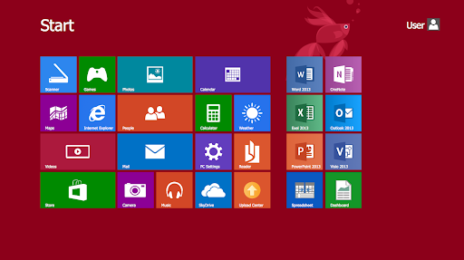

The **Command Line Interface (CLI)** is a command line program that accepts text input to execute operating system functions. The command line comes in handy for programmers when they need to complete tasks not available to features found on a GUI.

It is important to note that the CLI <ins>does not natively include the ability to carry out functions by means of a pointing device.</ins> This is because the CLI is a **text-based user interface**, meaning it uses text to process commands to a computer program instead of a graphical interface.

    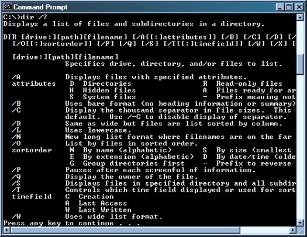

The user interface, which comes in the form of either a CLI or GUI, is an important part of an operating system because it allows a user to enter and receive information. Without a user interface, end-users can't control things like a software application or hardware device.

<h4>3. Supporting Application Software</h4>

**Key Terms**
- **Applications**
- **End Users**

**Application software** is a type of computer program that performs a specific function.

Applications are designed to assist **end-users** with a particular process, which may be related to productivity, creativity, and/or communication. The term **end-user** describes the person who uses a particular product.
Application software programs are created to facilitate a variety of functions, including but not limited to: 

- Managing information
- Manipulating data
- Constructing visuals
- Coordinating resources
- Calculating figures

Examples of application software include items like:
- Microsoft suite of products (Office, Excel, Word, PowerPoint, Outlook, etc.)
- Internet browsers like Firefox, Safari, and Chrome
- Pandora (for music appreciation)
- Skype (for real-time online communication)
- Slack (for team collaboration)

Application software depends upon the <ins>operating system</ins> to act as the interface between the end-user and the computer hardware. 

With this in mind, It is important to recognize that there is a relationship between the two types of software:
- System Software (operating systems)
- Application Software (user-downloaded programs)

The relationship is that **system software is used to support application software.**

<h4>Examples of Operating Systems</h4>

    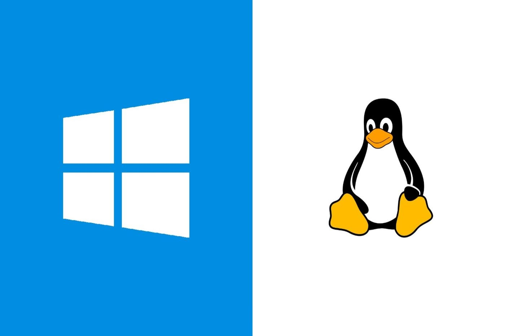

Various operating systems are found on computing devices. These are a few different types of computers that run <ins>unique operating systems</ins>:

- Desktops/Laptops

    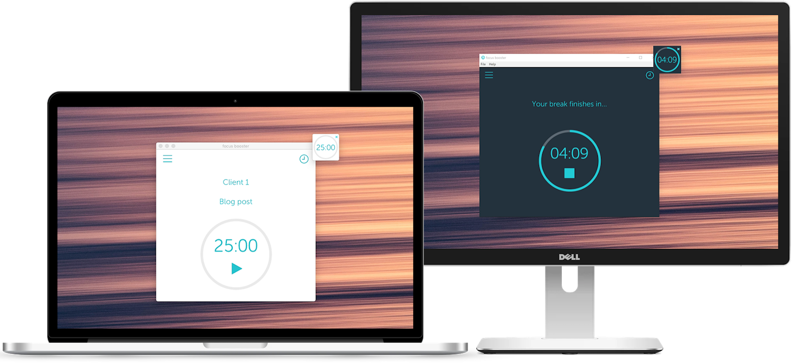

- Mobile Devices

    

- Tablets

    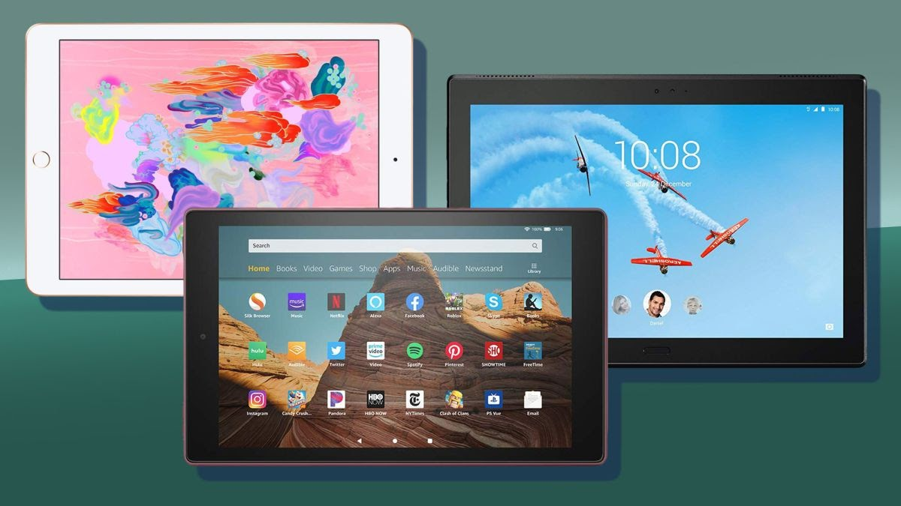

- Consoles

    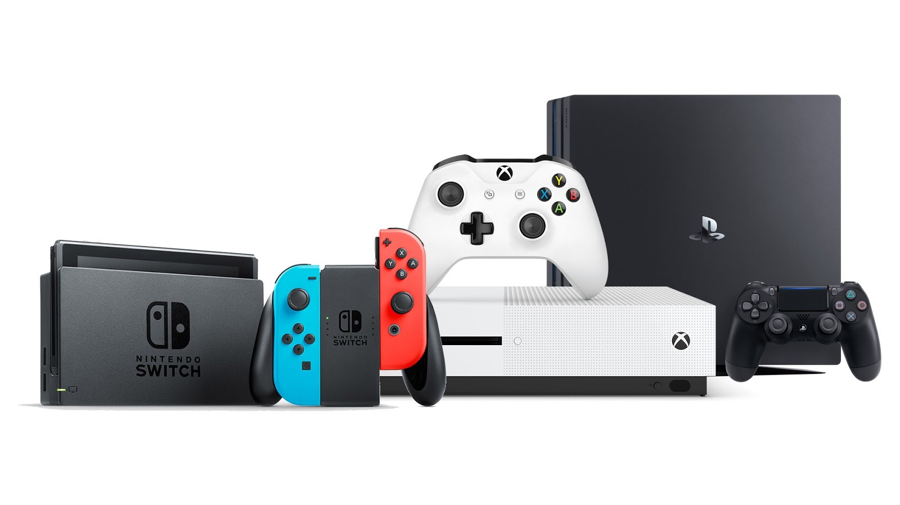

In the next part of the lesson we will be reviewing a few examples of desktop operating systems.

<h4>Microsoft Windows</h4>

**Key Terms**
- **Microsoft Windows**

**Microsoft Windows** is a computer operating system that was developed by Microsoft Corporation in 1985 to run personal computers (PCs). Microsoft Windows is the most widely used desktop operating system. This is because Windows comes preloaded on most new PCs, so it is found on most home computers.

There have been many different versions of Windows, but the most recent ones are:
- Windows 10 (released in 2015)
- Windows 8 (2012)
- Windows 7 (2009)
- Windows Vista (2007)

The name of the Windows OS comes from the fact that programs are run in “windows”: each program has its own window, and you can have several programs open at the same time. 

    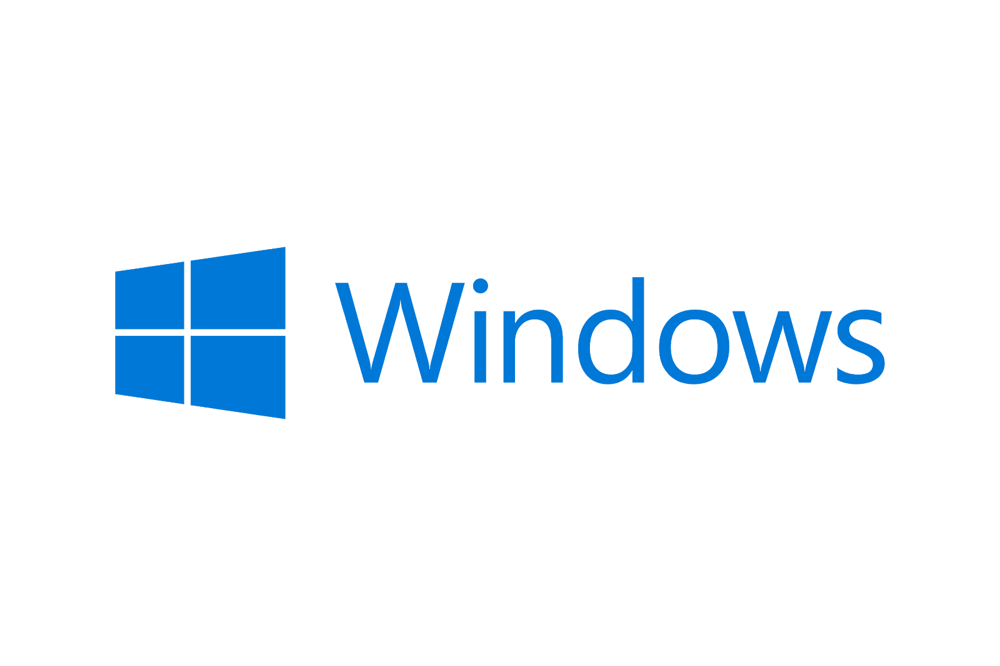

    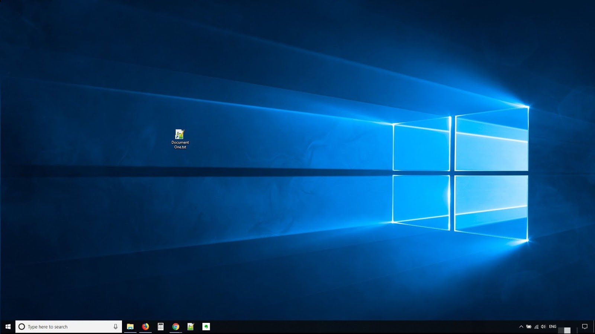

<h3>Linux</h3>

**Key Terms**
- **Linux**
- **Open-Source Software**
- **Kernel**
- **Distributions & GNU**
- **Bootloader**
- **Init System**
- **Daemons**
- **Graphical Server**
- **Desktop Environment**
- **Applications**

**Linux** is an operating system that was first released in 1991 by Linus Torvalds. Whether you want to learn IT or software development, Linux is a mainstay in the developer community as an operating system. The major difference between it and the Windows/Mac operating systems is that Linux is **open-sourced**. This means that Linux is completely free to download and use across as many computers as you would like. What makes Linux open-sourced is the ability for any user to change its source code (which can be thought of as the exact rules for which an OS runs). There are pros and cons to having an open source operating system, which we will list here.

**Pros**
- Great for users that want to make changes to how their operating system works
- Open source is more developer-friendly
- Free to install on your computer(s)
- More secure as developers across the world have access to source code
- Any developer can offer code updates to be implemented to Linux
- Works on computers with low system specifications

**Cons**
- Learning curve as Linux differs from other OS’s
- Certain applications do not work on Linux that might be specific to Mac or Windows
- Not many people use Linux for their computer’s operating system, as it’s most significant use today is for developers
- Not as user-friendly as Mac or Windows

Linux comes in many forms (seriously- there’s over 500!), called “**distributions**” or “distros” for short. What makes them all Linux operating systems is that they are based on the Linux kernel. Distros of Linux derive from either Debian or RPM, which are the two package managers for Linux distros. ***A typical Linux distribution consists of a*** <ins>***Linux kernel***</ins> ***and*** <ins>***GNU packages***</ins>.

The Linux **kernel** is the core of the operating system and the layer nearest to the hardware. The kernel manages computer resources, thus providing one of the basic operating system functions that we described earlier in the lesson. These resources include the computer’s processor (CPU), memory (ex. RAM), storage (ex. Solid State Drives), and peripheral devices (ex. keyboards).

    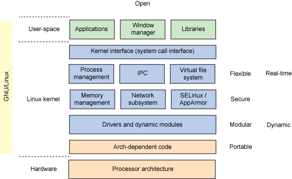

<i>(Photo source: IBM)</i>

 

While the kernel is the most important part of a Linux operating system, it would not be complete without the many open source packages that compliment it. Many of these packages are a part of the **GNU Project** which is an open software initiative started by the Free Software Foundation in 1984. While the formal name for Linux operating systems is often referred to as Linux/GNU, you can casually refer to it as Linux. Additionally, as you can see in the above chart, GNU utilities live in the user-space and include software like compilers (ex. GCC which interprets the programming language “C”) and command line tools (ex. Bash). These tools, other GNU tools, and non-GNU tools (ex. the Python programming language) combine to form the basis of the operating system that you will be using throughout the CSX Program.

Now, let’s explore some pieces of the Linux operating system. The **bootloader** is the first interaction you’ll have with the Linux OS on the Raspberry Pi. The first time you “boot”, or start this computer up, you will get an initializer for New Out Of Box Software (also known as NOOBS).

Background services such as printing, system volume, database servers on your computer, and even starting web servers are all examples of daemons. **Daemons** are simply background services that are started upon boot or after you login, depending on the service. These daemons, in general, are controlled by the **init system** which manages the user-space and daemons once it is handed the boot process from the bootloader.

Now to focus on the user-space, which is the area that users interact with the Linux/GNU operating system, there is the **graphical server**, a desktop environment, and applications. The graphical server is the system that displays graphics on your monitor/screen. The **desktop environment** is the part of the user-space that you will directly interact with, which in our case is “LXDE” that stands for Lightweight x11 Desktop Environment (fun fact- it is written in the programming language C!). The **applications**, commonly referred to as “apps”, are the programs you likely frequent the most and include previously mentioned applications such as the Microsoft Office Suite.

Earlier in the lesson, we discussed some of the most common operating systems in the world. Now that we’ve explored Linux/GNU at length, let’s learn about how Linux/GNU influenced or is a part of these systems:

- **Android** - The Android OS uses a modified version of the Linux kernel.
- **Microsoft Windows**- Windows makes use of many GNU tools that operate in the user-space, thus the command line and some of it’s tools will resemble your experience this year with our Linux/GNU command line.
- **Apple macOS**- Mac OS is based off of Unix, which predates Linux. Linux was influenced by Unix.
 

Click on Tux to learn more about Linus Torvalds

    <a href="https://www.youtube.com/watch?v=o8NPllzkFhE">
    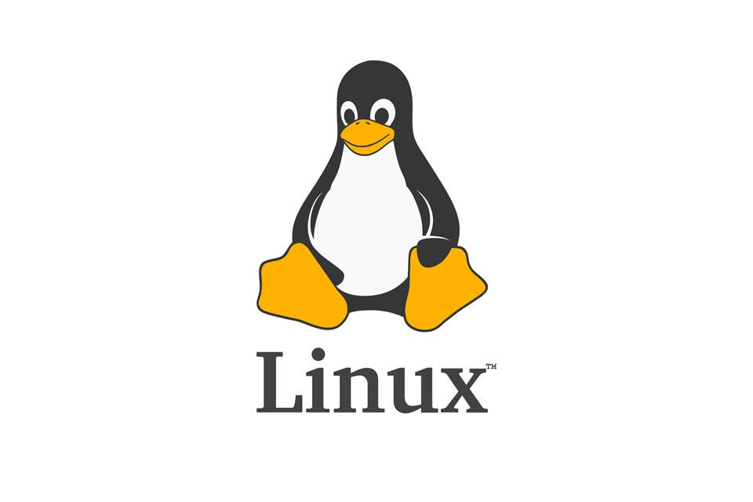
    </a>

    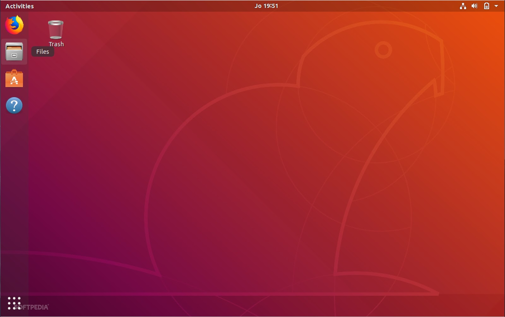

<h3>Raspberry Pi OS based in Debian GNU/Linux</h3>

**Key Terms**
- **Debian**
- **Raspbian**

**Debian** is an open source distribution of GNU/Linux developed by the Debian Project and Ian Murdock. The first version of Debian was released in 1993 and has been updated by its community ever since. Given Linux’s age, Debian is one of the oldest distros of Linux as well as and has been following the principles of the GNU Project.  Here are some of the pros specific to Debian:

- It is easy to install and maintain applications. Many times in other operating systems, when you update packages or applications, the old version is kept in your computer's storage. Debian overwrites previous versions without having to worry about granular details thanks to its package manager.
- Packages are generally created by qualified developers that are committed to upholding Debian’s standards and practices. 
- Debian is generally faster than most other operating systems thanks to its base in Linux.

    

    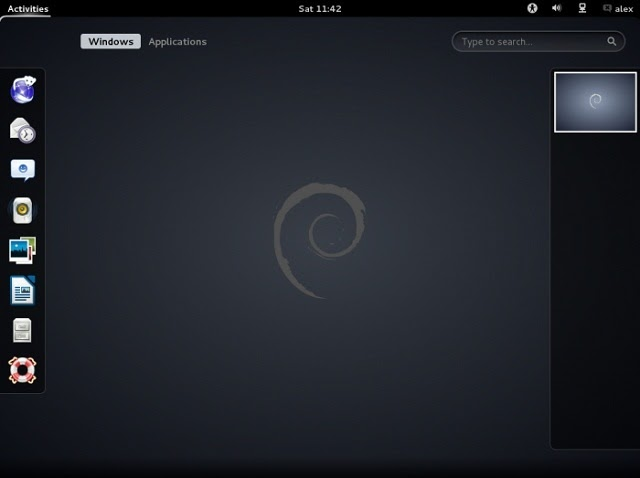

A little fun fact about Debian’s naming scheme for their releases: Debian releases are named after Toy Story characters! This originated when Bruce Perens served as the Debian Project Leader while also working for Pixar.

**Raspbian** is a Debian based operating system optimized for the Raspberry Pi. As updates are released for Debian, usually an update for Raspbian is updated, with the same release names. You will come to find out that the Raspberry Pi does not need to run as a desktop environment, but Raspbian gives this opportunity.

Raspbian is one of the most popular operating systems for Raspberry Pi because:
- The community is run by volunteers with forums including over 1 million posts, so if you have a question, it has most likely been answered before or it will be answered fairly quickly.
- The OS provides a user-friendly experience that isn’t always found with Linux distros. There are many pre-installed packages that come with the initial download of Raspberry Pi OS that gives beginners a better chance at the learning curve of using a distro.
- Since it is Debian based, you can rely on the OS for its stability.

Raspbian comes packed with all of the major tools that come with your average Windows PC such as:
- Can use a GUI when connected to a display.
- Also has access to a CLI when one is needed.
- Create and edit word documents, spreadsheets and presentations.
- View images and videos.
- Code editing for programming.
- General web surfing.

    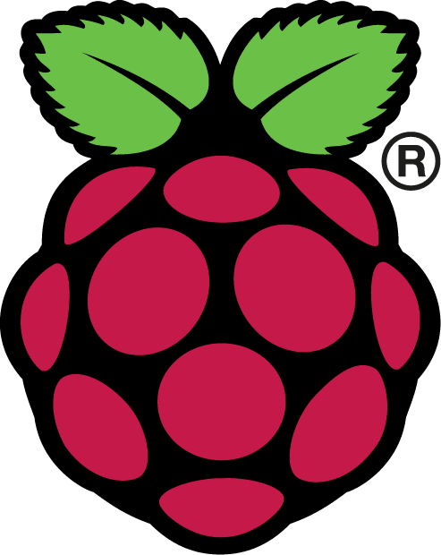

    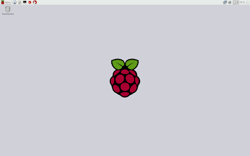

<h3>Programming Languages</h3>

**Key Terms**
- **Programming Language**
- **Syntax**
- **Compiled Programming Languages**
- **Compilers**
- **Interpreted Programming Languages**
- **Interpreters**

A **programming language** is a formal language that contains a set of instructions to produce certain outputs. The rules that define the written part of a programming language are called **syntax**. The two primary types of programming languages are compiled programming languages and interpreted programming languages. **Compiled programming languages** (ex. C) are languages that can be directly translated by the computer via a **compiler** (ex. GCC), which takes a program written in some compiled programming language and converts it to binary code that is executable by the machine. Remember- computers speak in 1’s and 0’s! While compilers can translate to machine level code as we just stated, it's important to understand that the formal definition of a compiler simply states that it can translate code from language "x" to language "y", and that it does not necessarily have to translate to a "lower level" of code. Here is an overly complicated chart that describes that process, but can be useful for those students who like to understand computing in its most basic form.

    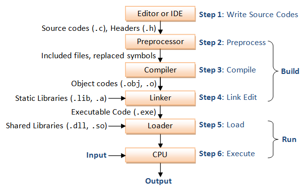

**Interpreted programming languages** (ex. Python) are languages that execute a program’s instructions directly via an **interpreter** (ex. CPython), which converts the source code of the Python program into byte code and executes it. While technically interpreted programming languages must compile the Python code into byte code, we still informally refer to this family of programming languages as "interpreted", as it is the interpreter doing the heavy lifting and compiling of the code.

<h2>Section 2 Review Questions</h2>

1. **Which of the following is not considered a basic function of an operating system:**

<b>a.</b> It supports application software (F)

<b>b.</b> It establishes a user interfaces (E)

<b>c.</b> It acts as the brain of the computer (C)

<b>d.</b> It manages computer resources (J)

 

2. **Which desktop operating system is the most used worldwide?**

<b>a.</b> Linux (Q)

<b>b.</b> Windows (L)

<b>c.</b> Raspberry Pi OS (N)

<b>d.</b> macOS (H)

 

3. **What of the following is common amongst all Linux operating systems?**

<b>a.</b> NGU Tools (B)

<b>b.</b> The Linux kernel (O)

<b>c.</b> They are Debian-based (S)

<b>d.</b> None of the above (A)

 

4. **Which of the following Linux components is the term that describes a background process?**

<b>a.</b> Daemon (C)

<b>b.</b> Bootloader (Z)

<b>c.</b> Graphical Server (B)

<b>d.</b> Kernel (R)

 

5. **The following are all correct about Raspbian except:**

<b>a.</b> There is a robust community of developers that have either experienced a given problem or are willing to help (B)

<b>b.</b> Its pre-installed packages give users a better chance at overcoming the learning curve of using a Linux distro. 
(L)

<b>c.</b> Raspbian is based in Debian (R)

<b>d.</b> All of the above (K)

 

**Which of the following software is needed to run a Python file on your computer?**

<b>a.</b> Compiler (A)

<b>b.</b> The GNU package “GCC” (D)

<b>c.</b> The Linux kernel (Y)

<b>d.</b> Interpreter (S)

 

**What have hands but no arms and faces but no eyes? _ _ _ _ _ _**
