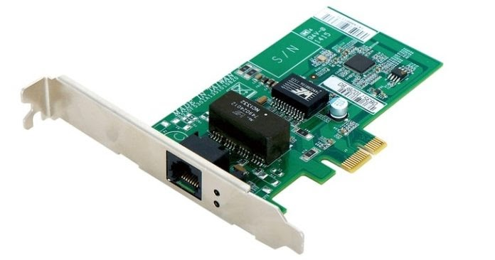
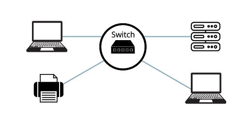
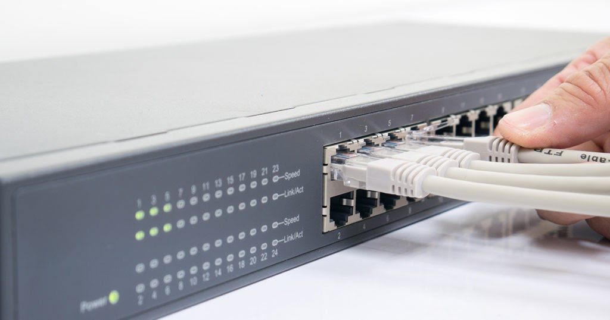
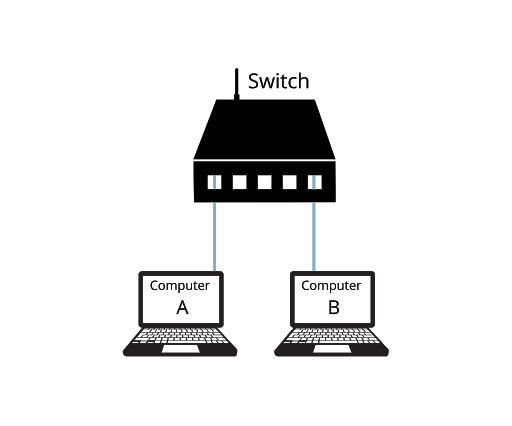
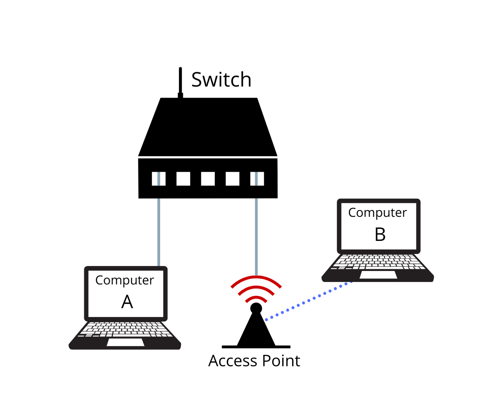
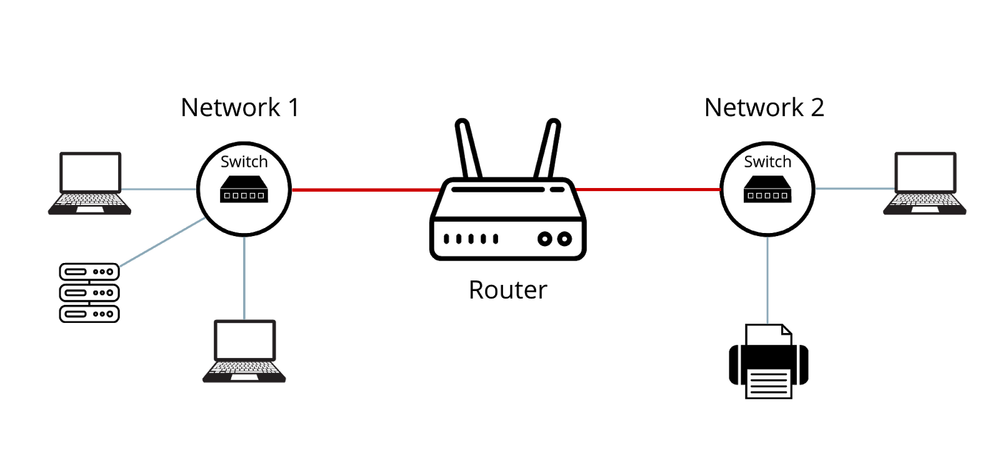
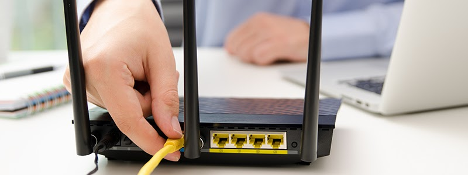
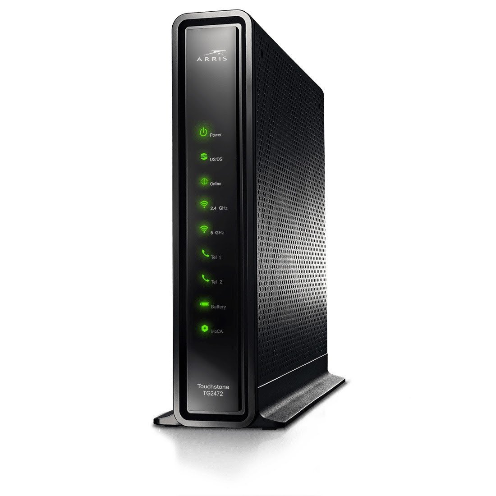
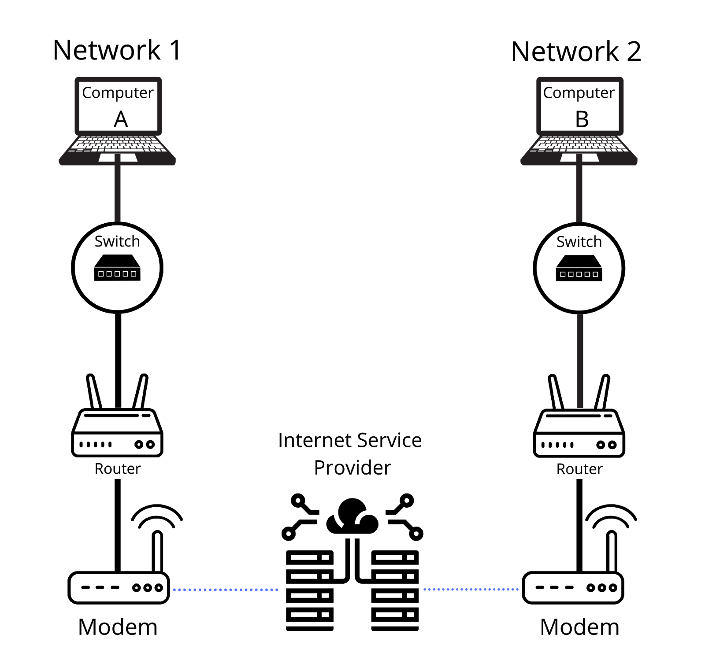

<h1>Networking and the Internet</h1>

The purpose of this section is to introduce you to the following concepts: 
- Defining what is a computer network.
- Reviewing basic networking concepts.
- Understanding the internet and how it works.

<h2>What is a Network?</h2>

A **network** is a group of computing devices that communicate with one another to share information. A network consists of two or more computers that are linked in order to share resources, exchange files, or allow electronic communications.

There are two basic types of Networks: 
    1. **Local Area Network (LAN)** is a collection of devices connected together in one physical location, such as a building, office, or home
    2. **Wide Area Network (WAN)** is a large network of information that is not tied to a single location.

In this lesson we will review examples that depict both local and wide area networks.

<h2>Basic Networking Concepts</h2>

**Key Terms**
- **Network Interface Card**
- **Switch**
- **Ethernet Cable**
- **Access Point**
- **Router**
- **Internet**
- **Modem**
- **Internet Service Provider**

<ins><i><h4>Network Interface Cards</h5></i></ins>

Desktops, laptops, printers, and mobile devices are all examples of network devices. This is because they all utilize a **network interface card (NIC)**, which is a <ins>computer hardware component</ins> that allows a computing device to connect to a network. **NICs** allow for both wired and wireless communications between devices and networks.

    

<ins><i><h4>Switches</h4></i></ins>

A **switch** is a piece of hardware that connects multiple devices in one physical location, creating a local area network (LAN). In other words, switches allow locally connected devices to share information and talk to each other.

    

As you can see in the image below, switches are connected using wires called **ethernet cables**:

    

**Example #1**: Computer A needs to share a file with Computer B. All of these devices are located in the same room.

    

In this example, both computers are connected to a switch. For this reason they are able to communicate, or “talk”. This communication allows for the sharing data, including the file Computer A needs to send to Computer B.

<ins><i><h4>Access Points</h4></i></ins>

An **Access Point** is a networking device that creates a wireless local area network (WLAN). This allows computing devices to connect to a switch wirelessly. 

    

**Example #2**: Computer A needs to share a file with Computer B. All of these devices are located in the same room, but Computer B is utilizing a wireless connection.

    

In example #2, Computer B is connecting to the Switch wirelessly using an access point. Nonetheless, Computer A is able to exchange files with Computer B by utilizing the switch.

<ins><i><h4>Routers</h4></i></ins>

A **router** is a device that forwards data across networks. A router’s job is to connect different networks together.

    

As you can see in the image above, using a router allows a computer on Network 1 to send data to a computer on Network 2. In this example, one router is connecting two individual LANs so they can communicate with each other. In the next section we will see how multiple routers can communicate with each other over the internet.

    

<h2>How Does the Internet Work?</h2>

**Example #3**: Computer A needs to share a file with Computer C. The two devices are located in different offices.

In order for Computer A to share a file with a computer that is in a different building, it is going to have to use the internet. To keep things simple, the internet is a global network of computers. Generally known as the wide area network (WAN), the internet connects computers from around the world!

    

Even though the internet seems so vast and complicated, it operates very similarly to the smaller networks that we reviewed during this lesson. In reality, the internet actually just connects many local networks together via a ton of routers. This action of connecting these routers is performed by internet service providers.

An **Internet service provider (ISP)** is an organization that provides services for accessing, using, or participating in the Internet. Some examples of ISPs you might have heard of are AT&T, Verizon, and Comcast. 

End-users are able to connect to internet services using a modem. A **modem** is a small network device that connects other devices to the Internet

    

The following diagram depicts how Computer A can share a file with Computer B over the internet:

    

<h2>Section 4 Review Questions</h2>

1. **Which of the following are considered the two basic types of Networks? (Choose two options)**
    
<b>a.</b> WAN (S)

    
<b>b.</b> PAN (K)

    
<b>c.</b> NAN (C)

    
<b>d.</b> LAN (E)

     

2. **A switch is a piece of hardware that:**
    
<b>a.</b> Connects multiple devices in one physical location. (V)

    
<b>b.</b> Forwards data across networks. (T)

    
<b>c.</b> Connects multiple devices all over the world. (J)

    
<b>d.</b> Connects other devices to the Internet. (G)

     

3. **A _______ is a networking device that creates a wireless local area network (WLAN).**
    
<b>a.</b> Router (D)

    
<b>b.</b> Switch (F)

    
<b>c.</b> Access point (E)

    
<b>d.</b> Modem (G)

     

4. **What type of organization provides services for accessing, using, or participating in the Internet?**
    
<b>a.</b> Internet Provider (O)

    
<b>b.</b> Online Service Provider (S)

    
<b>c.</b> Internet Connection Provider (L)

    
<b>d.</b> Internet Service Provider (N)

     

**I am an odd number. Take away a letter and I become even. What number am I?  _ _ _ _ _**
