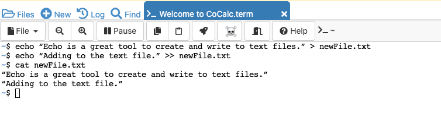
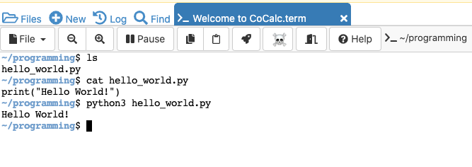
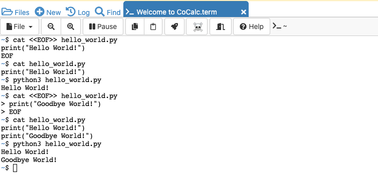
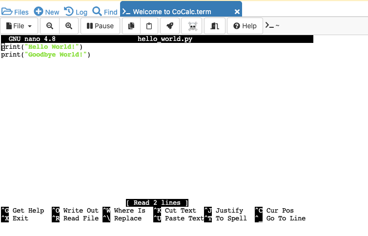
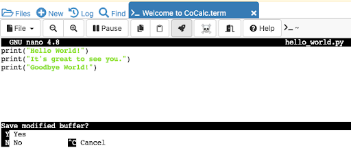
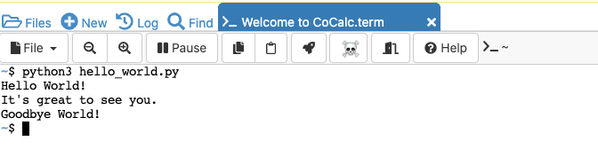

<h1>Section 6: Using the Command Line</h1>

The purpose of this section is to introduce you to the following concepts: 
- Reviewing command line commands from last lesson.
- Learn new commands and how to work with files.

<h2>Review</h2>

- Check your working directory with `pwd`
- Check the contents of your directory with `ls`
- Change your working directory to one within your current working directory with `cd folderName`
- To move up a level in your working directory, use `cd ..`
- Create directories with `mkdir folderName`
- Create blank files with `touch fileName.fileExtension` (i.e. `touch hello_world.py`)
- Delete files with `rm fileName` and delete folders using the "-r" flag such as `rm -r folderName`

<h2>New Commands</h2>

Click <a href="https://cocalc.com/doc/terminal.html">here</a> to revisit the terminal emulator from the last lesson. In the previous lesson, we learned how to create empty files using touch. We will now explore a command that can create a text file and write contents to it. "echo" uses the following structure:
`echo "Whatever text you want in quotes" > newFile.txt`

Let’s create a text file called *newFile.txt* with the contents reading "Echo is a great tool to create and write to text files."

This command should look like the following:
`echo "Echo is a great tool to create and write to text files." > newFile.txt`

Notice the structure of using only ">" in the command. This is for when you are writing to empty files (or want to overwrite an entire file.) If you want to add to a text file, we can use two arrows ">>" which is also known as "piping" an output to a file. Use the following to add "Adding to the text file." to the end of newFile.txt.
`echo "Adding to the text file." >> newFile.txt`

Want to check if this was a success? Well there is a command for reading files! We can use `cat fileName` to read the contents of the files without actually opening it. In your terminal, enter the following:
`cat newFile.txt`.

You should see the following output in your terminal:

    <kbd>
        
    </kbd>

 

"cat" is short for "concatenate" and is a powerful command that can be utilized in many ways. Similar to how we just used "cat", we can display the contents of files with their line numbers showing. Our first line in newFile.txt should be **"Echo is a great tool to create and write to text files."** and the second line will be **"Adding to the text file."** This is done by using the "-n" flag as such:
`cat -n newFile.txt`

"cat" is also used to create and write to non-text files. Here we will use the "cat" command to create a file named *hello_world.py*, where we will create a Python program to output the phrase "Hello World!".

In your terminal execute the following command:
`cat <<EOF>> hello_world.py`

Then, write the following into the terminal and press enter:
`print("Hello World!")`

Lastly type in `EOF` and hit enter. Here "EOF" is used to indicate to the terminal that we are finished editing the file.

Notice the structure of our command:
1. The terminal recognizes "cat" and looks for what comes next
2. <<EOF>> tells the terminal to add the input after the command to the end of the file
3. You specify which file you want to add to
4. Add whatever contents you’d like to the file (you can add multiple lines too!)
5. Use `EOF` to close the file editor

Now, use the "cat" command to read the file’s contents using:
`cat hello_world.py`

Let’s test out our Python file by using `python3 hello_world.py`. "python3" is a command you use to run Python files from your terminal, and whatever you "print" in the Python file will be output to the terminal. We are expecting our program to have an output of "Hello World!". Your terminal should look like the following after running the Python file.

    <kbd>
        
    </kbd>

 

Lastly, you can use the "cat" command to add to the end of files. Let’s add another print statement to "hello_world.py" that when executed outputs "Goodbye World!"

To do so, we will execute the following in the terminal:
`cat <<EOF>> hello_world.py`
`print("Goodbye World!")`

Use the "cat" command to read `hello_world.py` and make sure the command is executed correctly: `cat hello_world.py`

Then run the Python file using `python3 hello_world.py`. You should see the following output:

    <kbd>
        
    </kbd>

 

### Exercise

1. Break into groups of two.

2. Create a new file called "partner.py". Ask your partner a question such as "What is your favorite food?", or "Where are you from?". You and your partner must ask each other different questions.

3. Have your file output your partner's response to your question. Run that file.

4. Add in another line of code to output your own response to the question that you asked your partner. Run the file once more.

<h2>…More Commands!</h2>

We have been working in the terminal outside of files using "cat", rather than by reading/writing a file's contents from within the file itself. Well…there is a command for that! "nano" is a command line text-editor that allows you to open files and edit them directly in the terminal.

In your terminal, enter the following:
`nano hello_world.py`

You’ll see the following screen:

    <kbd>
        
    </kbd>

 

Here you can edit files freely.

> Keep in mind this is the command line, not a GUI! You will not be able to navigate the file with your mouse, and must use your arrow keys.

Let’s add another print statement after our original "Hello World!" that will read "It’s great to see you." To do so, use your keyboard to navigate to the end of the first print statement and hit enter. Then you will have a new line between the two print statements.

On that line enter the following:
`print("It’s great to see you.")`

Now to close the file press the "control" key and "x" key together. You’ll see the following screen:

    <kbd>
        
    </kbd>

 

Press "Y" to save the changes you made and then press the "Enter" key. Let’s test our file. In the terminal, enter:
`python3 hello_world.py`. If the task was done successfully, you should see the following:

    <kbd>
        
    </kbd>

 

Now that we understand the fundamentals along with "cat" and "nano", let’s take a look at an example of a more advanced tool called **sed**. "sed", or "stream editor", can perform many tasks. For example, it can execute a find and replace inside a file that you specify. The commands structure would look like the following:
`sed "s/word_to_replace/new_word/#_of_times_to_replace" file_name`

Create a text file in your programming folder named "cat_hat.txt" using the command `touch cat_hat.txt`. Then use "nano" to edit the file and paste in the text from <a href="https://docs.google.com/document/d/1TlJmCw_FUclphlJ1VVqAFKsNduzV4bVXwzfsDbccnws/edit">here</a>. This is the famous Cat In The Hat story from Dr. Seuss. We are going to replace "cat" in the story with "bat" using the **sed** command.

In your terminal now, enter the following command:
`sed "s/cat/bat/g" cat_hat.txt`
    1. cat is the word to be replaced
    2. bat is the word replacing cat
    3. "g" is used to signify to the terminal to replace every instance where cat is used.
        - If you wanted every other "cat" to be replaced by "bat", then you would put "2" instead of "g". 
You’ll see the terminal gives you an output after executing the above command. Here you’ll see that the word "bat" has replaced "cat" in every instance.

### Exercise

1. Replace every instance of the word "bat" with "rat". View the output and observe if it behaved the way you wanted it to.

2. Replace every instance of the word "hat" with "mat". View the output and observe if it behaved the way you wanted it to. Discuss this output with the class.
