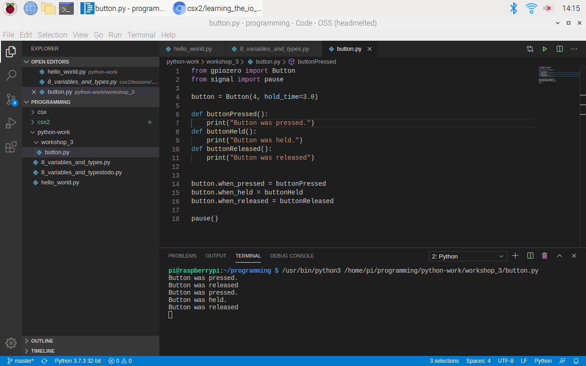
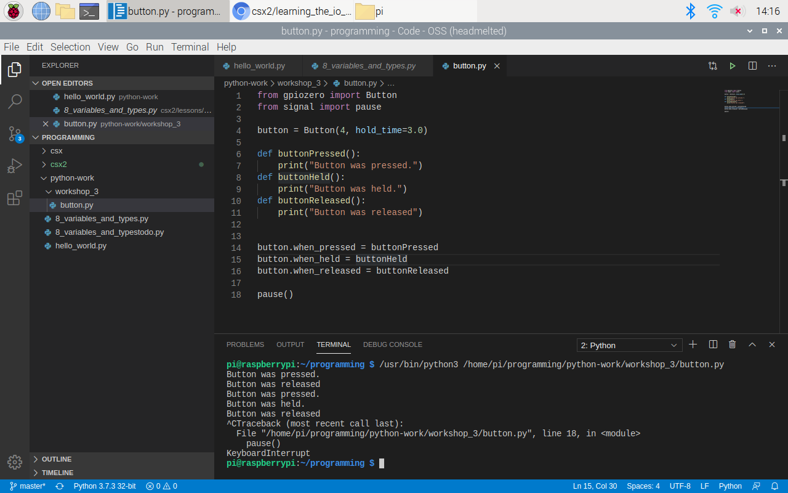

<h1>Using the I/O Devices with Your Raspberry Pi</h1>

In this workshop, the student will learn:
- More about The Raspberry Pi's GPIO pins
- How to properly connect a tactile button and LED light to the Pi and make them functional using Python

All students should have the Pi turned on and ready to use for the remainder of the workshop.

Here is the list of external parts you need besides your Raspberry Pi Desktop that came with your package:

- One (1) Breadboard
- One (1) Male-Male Jumper Wire
- Eight (8) Female-Male Jumper Wires
- Three (3) LED Lights (Red, Yellow, & Green)
- One (1) Tactile Buttons
- Three (3) Ohm Resistors

    

<h2>The Physical Components</h2>

<h4>1. The Breadboard</h4>

A breadboard is a device used for temporary or prototype electronics. Breadboards are solderless, meaning that there is no need to melt any wires to allow for an electrical current to pass through.

    

There are **three (3)** types of rails on the breadboard we are using. The **red line** marks the *positive* rail, the **blue line** marks the *negative* rail, and the **component rails** are each row of *five pin holes*. Your breadboard has two sides, each seperated by a gutter in the middle. Utilizing the different rails will be gone over for each I/O device later in the workshop.

<h4>2. Jumper Wires</h4>

Female to Male:

    

<i>In the image you can see one side of the wire is used to plug <ins>into another device</ins>, while 
the opposite side is used to plug <ins>other devices into it</ins>.</i>

 

Female to Female:

    

<i>Both ends of the wire are used to plug <ins>other devices into it</ins>.</i>

 

Male to Male:

    

<i>Both ends of the wire are used to plug <ins>into other devices</ins>.</i>

<h4>3. The GPIO Pins</h4>

    

 

Now you have heard a little bit about GPIO pins earlier in the semester. GPIO is short for "General Purpose Input/Output". An important thing to note right off the bat is that not all pins act the same. Some pins can provide a power *output* such as <ins>3v3 and 5v pins</ins>, others can receive and measure power *inputs* like <ins>"gnd" or ground pins</ins>. Over all though, a majority of the pins are used for reading inputs or providing outputs. 

How can we tell the difference between the pins? The GPIO Zero Python Library provides a command line tool that is installed by default on your Raspberry Pi, so users can have a better understanding of their Pi. Open the terminal and enter in the prompt, `pinout`. You will see the following:

    

 

This provides a layout of each pin on your Raspberry Pi and they type of pin it is. You can also see it provides some information on where some of the physical components of your pi are for reference as well.

In this workshop we will refer to pins in a couple different ways.
1. One can be referred to as *GPIO[INSERT NUMBER]*. This would be referencing the pins name that can be seen using the `pinout` function in bold green lettering.
2. The alternative is calling out pins by their physical location such as *physical pin 6* when referring to the **GND** pin on the Pi's 6th pin which can also be seen using the `pinout` function, but instead is the number in paranthesis.

Now that we have a better idea about some of the components we will be using to make our i/o devices functional, let's start using them.

Open VS Code on your Pi and in your *python-work* folder, create a folder named *workshop_3*. Inside the *workshop_3* folder, create a file named "button.py".

<h2>Tactile Button</h2>

A tactile button can be used to give inputs to your Raspberry Pi by clicking the button while a program is running. This clasifies the tactile button as an **input** device. We will first code the button in Python, and then physically connect it to the Pi.

1. In button.py, we are first going to import the Button class fomr the "gpiozero" library and the pause function from the "signal" package. To do this, we will enter the following code at the top of button.py: 
`from gpiozero import Button `  
`from signal import pause`

2. Next, we can create an instance of the button class by using the number of the GPIO pin used when setting up our tactile button. We are using the **GIPIO4** pin, so we will specify that in the code and set it equal to the variable "button” as so:
 
`button = Button(4)`
> Specifying "4" is how Python knows which pin we will be using. 

3. Next we are going to define 3 methods for our button: "buttonPressed()”, “buttonHeld()”, and “buttonReleased()”. When these methods are used, each will print a statement regarding the action described in their name. Use the following in your file:
> Methods are simply functions that are specific to a certain class. The above methods would not be able to be used with any other class or data type.

        def buttonPressed():
        	print(“Button was pressed”)
        def buttonHeld():
        	print(“Button was held”)
        def buttonReleased():
        	print(“Button was released”)

4. The functions we have now defined will be used in conjunction with the three event **properties** of pressing, holding, and releasing the button. The Button class has: ".when_pressed", ".when_held", and ".when_released". The two properties that are  self explanatory and do not need much explaining are ".when_pressed" and ".when_released". On the other hand, ".when_held" can take in a specified time for the function to run. This is done by specifying “hold_time=[some_float]”, where some_float is a float data type, within the instantiation of our Button class.

`button = Button(4)`  
Will now be: 
`button = Button(4, hold_time = 3.0)`  
This will specify that for the buton_held function will wait 3 seconds before it executes its code.

5. Lastly, we need to use our “button” variable to call these functions. Use the following to do so:

        button.when_pressed = buttonPressed
        button.when_held = buttonHeld
        Button.when_released = buttonReleased

now when the tactile button is pressed, the method "buttonPressed" will run and print the statement, “Button was pressed”. If the button is held for 3 seconds, then the "buttonHeld' method will run. What do you think will execute when this method is called? Lastly, when the tactile button is released, the "buttonReleased" method will be called.

6. Our complete file should now look like the following:

        from gpiozero import Button 
        from signal import pause

        button = Button(4, hold_time=3.0)

        def buttonPressed():
            print("Button was pressed.")
        def buttonHeld():
            print("Button was held.")
        def buttonReleased():
            print("Button was released")

        button.when_pressed = buttonPressed
        button.when_held = buttonHeld
        button.when_released = buttonReleased

        pause()

> pause() is used to stop your program from running. To do so, we will use "control + c" to quit the program after having finished testing.
>> Check for any indentation errors as copying and pasting into VS Code can be tricky sometimes.

<h3>Assembling the Tactile Button</h3>

We will need the folling components for this section:
- Breadboard
- 1 Tactile Button
- 2 Female-Male Jumper Wires
- 1 Male-Male Jumper Wire

    

 

> **During this section, use the `pinout` command for a visual when GPIO pins are referenced.**

7. Connect a female-male jumper wire from the Raspberry Pi's **GND** pin to the **negative rail** of the bread board. This can be done at any **GND** pin, but we will connect the wire at *physical pin 6*.

    

 

8. Next we will place the tactile button across the gutter in the middle of the bread board. The top right leg should line up with the grounded wire.

    

 

9. Connect a male-male wire from the negative rail (directly to the right of where the grounded wire is inserted) of the breadboard and connect it to the row that the top-right leg of the button is on.

    

 

10. Lastly, connect a female-male jumper wire from the Pi's **GPIO4** pin to the breadboard where the top-left leg is placed.

    

 

You can use the following color coordinated diagrams of the breadboard and Pi if there was any confusion during assembly.

    

    

<h3>Using the Tactile Button</h3>

Now that everything is connected, we can execute our Python program. Execute the program by clicking the execute button (the green triangle) at the top right corner of the file.

When you press the tactile button on the breadboard, you should see the following output:

    

 

Try holding the tactile button now for 3 seconds. You'll see the following output now:

    

 

Now in the terminal, press the "control button" and "c" at the same time to end the program. You'll know you're successful in quitting the program when you see the following output:

    

 

Let's move on to learning about the LED light now. Go ahead and disconnect all of the external components to start fresh.

<h2>LED Light</h2>

An LED light can be used to provide an *output* too. When a block of code is executed, the Pi will turn the light on and off. This makes the light an output device. Again, we will code the program in Python first, and then assemble the physical components.

11. In your *workshop_3* folder, create a file named "led.py".

12. We will be using the gpiozero library again to import the LED class to use its .blink() method. The .blink() method has a default timeout of one (1) second and will continue to blink every other second until the program is exited with the pause() function.

13. Paste the following into your "led.py" file:

        from gpiozero import LED
        from signal import pause

        led = LED(4) # 4 is specifying which GPIO pin we will be using.
        led.blink()

        pause()
> Again please look out for indentation errors.

<h3>Assembling the LED Light</h3>

We will need the following components for this section:
- Breadboard
- 1 LED light (any color is fine)
- 3 Female-Male Jumper Wires
- 1 330 Ohm Resistor

    

 

> **During this section, use the `pinout` command for a visual when GPIO pins are referenced.**

14. Connect a female-male jumper wire from the Raspberry Pi's **GND** pin to the **negative rail** of the bread board. This can be done at any **GND** pin, but we will connect the wire at *physical pin 6*.

15. Place the LED light into two holes on the breadboard that are next to eachother, but not on the same row. Also, neither leg should be on the same row as the **GND** wire.
    - The longer leg is the **positive leg**. This should be placed on the left side.
    - The shorter leg is the **negative leg**. This should be placed on the right side.

    

 

16. Connect the Ohm resister to the female end of a female-male jumper wire. Then connect the Ohm resistor end to a pin hole in the same row as the **negative leg** (the right leg) of the LED light and the jumper wire end to the negative rail next to the **GND** wire. If you have trouble with this wording, feel free to refer to the last images in this section for reference.

    

 

17. Connect a female-male jumper wire from the Pi's **GPIO4** pin to a hole on the breadboard in the same row as the **positive leg** of the LED light.

    

 

Here is another color coordinated diagram of the breadboard and Pi:

    

    

<h3>Using the LED Light</h3>

You should see the red light blinking for one second every other second. Go ahead and use "control + c" to quit the program and disconnect the LED. Now that you have worked with both the tactile button and the LED light, lets get started on the main activity of the workshop and create our "Ready, Set, Go" light sequence.

<h2>Ready, Set, Go!</h2>

In this section we are going to combine our knowledge about the tactile button and LED lights. The goal is to create a "ready, set, go" light system as if for a race with a red light, yellow light, and green light.

First we are giong to assemble the button and lights.

The components you will need are:
- 8 female-male jumper wires
- 1 male-male jumoer wires
- 1 tactile button
- 3 LED lights (red, yellow, and green)
- 3 330 Ohm resistors

    

 

> **During this section, use the `pinout` command for a visual when GPIO pins are referenced.**

<h4>Assembling Ready, Set, Go!</h4>

18. Even though we will have 4 devices, we only need to use one (1) **GND** pin, so we will use *physical pin 6*. Connect the female-male wire from the **GND** pin to the *negative rail*. Again we will be using the *physical pin 6*.

19. Now we will connect the three lights. Place the three lights on the same column as its shown below. The **positive leg** should be placed on the left side for each of the lights.

    

 

20. Connect each Ohm resistor to the female end of a female-male jumper wire. Plug the jumper wire side into the negative rail of the breadboard and the ohm resistor side on the same row as the negative leg of each LED light.

    

 

21. Next we are going to connect each light to a GPIO pin on the Pi. The red light should be connected to **GPIO14**, the yellow to **GPIO15**, and the green to **GPIO18**. Use a female-male jumper wire to do so.

    

 

22. Place the tactile button on the breadboard similar to how we did earlier in the workshop with some space from the lights. This will be used to start our light sequence.

23. Use a male-male jumper wire with one end plugged into the negative rail of the breadboard and the other end plugged into the same row as the top right leg of the button as seen in the image.

24. Lastly connect a female-male jumper wire from **GPIO4** on the Pi to the same row as the left leg of the button on the breadboard.

    

 

Again, if there was any confusion, here is a color coordinated diagram to help see where each item should be placed.

    

    

 

<h4>Coding Ready, Set, Go!</h4>

25. Create a file named "ready_set_go.py" in your *python-work* folder.

26. At the top of the file, import the Button and LED class from the gpiozero library as well as the pause function from the signal module. There are a couple different ways to do so if you remember from lesson 10 on imports.
        
        from gpiozero import Button, LED
        from signal import pause

27. We will also be importing a new module that is built in to Python known as the time module. We can use the time module to put a delay on the execution of our code to set a pause in between each light toggling on and off. Add the following import to your file.

        import time

28. Now, let's instantiate the Button class and store it in the variable "button", and we will be using the **GPIO4** pin. There's no need to set a hold time as it won't be necessary for this section.

        button = Button(4)

29. Next we want to instantiate three different LED classes. One for red, yellow, and green. Since we practice good coding skills, we are going to be descriptive in our variables:

        red_light = LED(14)
        yellow_light = LED(15)
        green_light = LED(18)

30. Now we want to create a function that, when called, will start the light sequence. Since we want to turn on each light and then turn it off in a sequence, we need to use a method other than "blink" from the LED class. The methods we will be using are the ".on()" and ".off()" methods. 

        def start_lights():
            red_light.on()
            time.sleep(1)
            red_light.off()

            yellow_light.on()
            time.sleep(1)
            yellow_light.off()

            green_light.on()
            time.sleep(1)
            green_light.off()

        pause()

31. Lastly, we set the "start_lights()" function to be called when the tactile button is pressed using the ".when_pressed()" method we learned earlier.

        button.when_pressed = start_lights

The complete file now looks like the following.

        from gpiozero import Button, LED
        from signal import pause
        import time

        button = Button(4)
        red_light = LED(14)
        yellow_light = LED(15)
        green_light = LED(18)

        def start_lights():
            red_light.on()
            time.sleep(1.5)
            red_light.off()
            time.sleep(1)

            yellow_light.on()
            time.sleep(1.5)
            yellow_light.off()
            time.sleep(1)

            green_light.on()
            time.sleep(1.5)
            green_light.off()
            time.sleep(1)

        button.when_pressed = start_lights

        pause()

Now we have a working light sequence! You can play around with the timing of the sequence and even add lights if you want.

Takeaways from this workshop:
- We can control our peripherals with Python and the gpiozero library 
- The breadboard should be grounded using the **GND** pin on the Pi and a jumper wire
- Ohm resistors need to be used to control the power output to the LED lights
- Each LED light needs its own Ohm resistor
- A single Python program can be used to control more than one peripheral
- You can use one peripheral to control others, such as using the tactile button to start our light sequence
