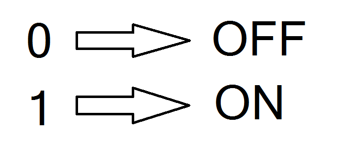
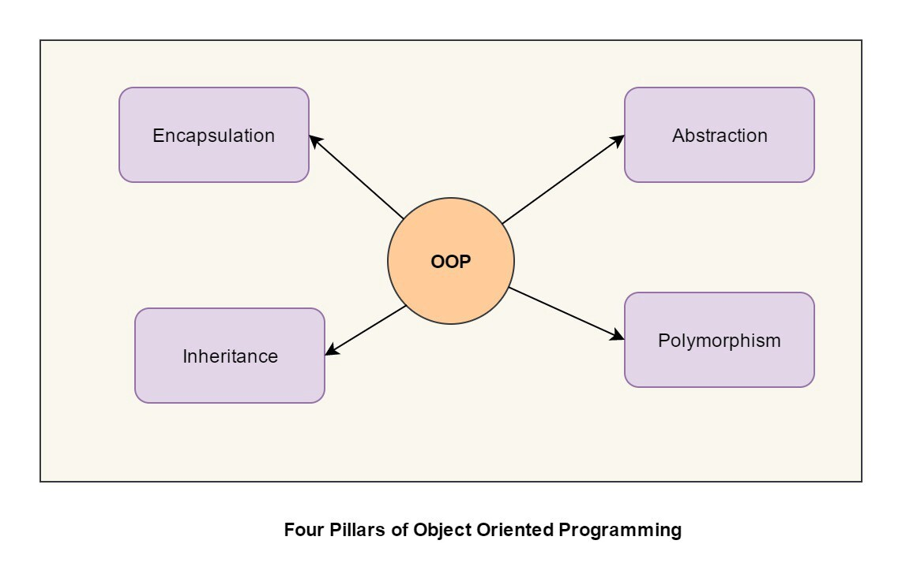

<div align=center><h1>Number Systems and Programming Languages</h1></div>

The purpose of this section is to introduce you to the following concepts: 
- Understanding number systems - specifically binary.
- Understanding Python as an interpreted, object-oriented programming language.

<div align=center><ins><h2>Part 1: Number Systems and Binary</h2></ins></div>

**Key Terms**
- **Number System**
- **Decimal Number System**
- **Binary Number System**
- **Bit**
- **Transistor**

<div align=center><h3>What is a Number System?</h3></div>

A **number system** is a system of naming or representing numbers. The following two examples show two different number systems:
  1. **Decimal number system**: the <ins>most commonly used number system</ins>, which consists of ten digits (0, 1, 2, 3, 4, 5, 6, 7, 8, and 9). We use the combination of these 10 digits to form all other numbers. 
  2. **Binary number system**: consists of two digits (0 and 1). The figures described under this system are known as binary numbers, which are a combination of 0 and 1.  - For example, 110101 is a binary number.
  
<div class=mdImage align=center>
    
</div>
  
 <div align=center><h3>How is Binary Related to Computers?</h3></div>
 
<ins>All computer data is represented using binary</ins>. A binary digit, or **bit**, is the smallest unit of data in computing. It is represented by a 0 or a 1. Binary numbers are made up of binary digits (bits).
The circuits in a computer's processor are made up of billions of transistors. A **transistor** is a tiny switch that is activated by the electronic signals it receives. The digits 1 and 0 used in binary reflect the on and off states of a transistor.

<div class=mdImage align=center>
    
</div>

Computer programs are sets of instructions. Each instruction is translated into machine code - simple binary codes that activate the CPU. Programmers write computer code and this is converted by a translator into binary instructions that the processor can execute.

<div align=center><h3>How to Read Binary Numbers</h3></div>

Each column on the following table represents the number two raised to an exponent, with that exponent's value increasing by one as you move through each of the eight positions. When determining the decimal value of a binary number, we will consider each of these columns to be either on or off.

|exponent|2<sup>7</sup>|2<sup>6</sup>|2<sup>5</sup>|2<sup>4</sup>|2<sup>3</sup>|2<sup>2</sup>|2<sup>1</sup>|2<sup>0</sup>|
|---|---|---|---|---|---|---|---|---| 
|Value|128|64|32|16|8|4|2|1| 
|OFF/ON|0 or 1|0 or 1|0 or 1|0 or 1|0 or 1|0 or 1|0 or 1|0 or 1|

For example: The following chart illustrates the binary number 01101000.

|exponent|2<sup>7</sup>|2<sup>6</sup>|2<sup>5</sup>|2<sup>4</sup>|2<sup>3</sup>|2<sup>2</sup>|2<sup>1</sup>|2<sup>0</sup>|
|---|---|---|---|---|---|---|---|---| 
|Value|128|64*|32*|16|8*|4|2|1| 
|OFF/ON|0|1|1|0|1|0|0|0|
<div><b>Note</b>: Values with * signifies a transister being turned on</div>
<br>

To get the total of this example, read the chart from <ins><b>right to left</b></ins> and add each column's value to the previous column: 
(8+32+64) = 104. This means that the value 01101000 in binary form is equal to 104 in decimal form.
  - As you can see, we do not count the bits with a 0 because they're "turned off."
  
**Group Exercise**: Imagine you are doing some work with a machine that can only process 8 bits at a time.  What would this look like in binary? What would be its maximum decimal value that it could process? Use the chart to visualize this concept. Feel free to use a calculator!
|exponent|2<sup>7</sup>|2<sup>6</sup>|2<sup>5</sup>|2<sup>4</sup>|2<sup>3</sup>|2<sup>2</sup>|2<sup>1</sup>|2<sup>0</sup>|
|---|---|---|---|---|---|---|---|---| 
|Value|128|64|32|16|8|4|2|1| 
|OFF/ON|0 or 1|0 or 1|0 or 1|0 or 1|0 or 1|0 or 1|0 or 1|0 or 1|

Understanding these number systems and converting from one system to another should give you a better understanding of how a computer works. When a computer wants to display a number, it will convert from the binary representation of that number to decimal by default. In the next section, you will learn more about the different forms of binary and how it relates to programming. Click <a href="https://www.youtube.com/watch?v=Xpk67YzOn5w">here</a> for a video to reinforce what we just learned about binary.

<div align=center><ins><h2>Part 2: Python</h2></ins></div>

**Key Terms**
- **Python**
- **Machine Code**
- **Bytecode**
- **Object-Orientated Programming**
- **Inheritance**
- **Polymorphism**
- **Encapsulation**
- **Data Abstraction**

<div align=center><h3>What is Python?</h3></div>

<div class=mdImage align=center>
    
</div>

In the last section, we reviewed that a programming language is a formal language that contains a set of instructions to produce certain outputs. In this course, the programming language that we will be focusing on is Python.
**Python** is “an interpreted, object-oriented, high-level programming language. Python's simple, easy to learn syntax emphasizes readability and therefore reduces the cost of program maintenance.” according to it’s documentation.

<div align=center><h3>The Inner Workings of Python</h3></div>

Now that you’ve come to understand binary in part 1 of this section, you can learn about the two forms in which it comes. First, we have **machine code** which is binary that can be executed directly by the target machine. **Bytecode**, on the other hand, is encoded to the specifications set by a “virtual machine”, thus allowing it to be interpreted.

Let’s review two important points about Python.

  1. It’s considered an interpreted programming language, meaning that it uses an interpreter rather than being directly compiled into machine code.
  2. It compiles it’s source code (i.e. the python program itself) into bytecode to be read by the interpreter.
  
Now, let’s take this information and move on to the question of “Is Python an interpreted or compiled programming language?” to which the answer is...yes! While we casually refer to the family of interpreted programming languages as simply “interpreted”, those languages still compile the source code into lower level code to be read by the interpreter.

If you are currently thinking that interpreted and compiled programming languages are completely different, then the above seems like a direct contradiction. Why would Python code be compiled if it’s an interpreted language? Well, that is simply how interpreted programming languages are run! CPython, which is a common Python interpreter, would then take that bytecode (which was compiled from the Python code), read those instructions, and execute them.

Let’s demonstrate this by showing the bytecode that is generated from a Python program. We can use a nifty built-in tool from Python called “<a href="https://docs.python.org/3/library/dis.html">dis</a>", which is a package that will “disassemble” the Python code and show us some neatly organized bytecode. Head over to https://repl.it/@enaard/Python-3, wait till the page loads, and enter the following line of Python code:

`print("Hello World! My name is [insert your name here]!")`

Run the code to view the output. There is your first line of Python code in this class! A very simple print statement that outputs your name. Now that you’ve previewed what Python syntax looks like, let’s introduce the “dis” package. We will define a function called “hello” that, when executed, would simply output a print statement just like we did above. However, instead of “calling”, or executing, that function we will use “dis” to display what the function looks like in bytecode.

```
import dis
def hello():
   print("Hello World! My name is [insert your name here]!")
dis.dis(hello)
```

With this understanding of what “interpreted” means when it comes to Python, let’s dive into the “object-oriented” side of things.

<div align=center><h3>What is Object-Orientated Programming?</h3></div>

**Object-Orientated Programming (OOP)** is the computer programming model that focuses on data or “objects” that can be manipulated rather than how to manipulate them. This is a common approach for large and complex programs. There are 4 elements that designate a programming language as object-orientated.
  
1. **Inheritance**:
  Inheritance specifies that a child object will acquire all of a parent objects given attributes and methods. You can think of a parent object like “Mammal” that would have child objects of “Human”, “Marsupial”, and “Canine”. Although Mammals can be defined by air breathing creatures, humans, marsupials and canines are all mammals, but will have their own set of attributes and methods associated.
  
2. **Polymorphism**:
  Polymorphism is to have many forms. In programming, this means that a singular function can be used on different types of objects. An example of this would be the len() function in Python. You can use this to find the length of the word “programming” (answer would be 10) or a list of words such as: computer, python, notebook.
  
3. **Encapsulation**:
  Encapsulation is how Python and other OOP languages restrict access to methods and variables. When methods are performed on an object, you wrap the object and any other necessary code together into a single unit so that the method only performs operations on the code you designate.  

4. **Data Abstraction**:
  Abstraction is often used as a synonym to encapsulation in the programming world because abstraction relies on encapsulation. Abstraction is how an oop language ignores any unnecessary details in a program. This is possible since encapsulation combines the related parts it needs to perform a method.

<div class=mdImage align=center>
    
</div>
  
<div align=center><h3>Python Overview Takeaways</h3></div>

1. You’ve learned about the two different types of binary: machine code and bytecode. 
2. You’ve learned that while Python is informally referred to as an interpreted programming language, it still requires compiling to be read by the interpreter.
3. You’ve seen your first bit of Python code and the bytecode that Python code is compiled to.

While there is so much more that happens under the hood of Python to make it work, there simply isn’t enough time in this program to review it all. We hope that this top-level overview serves you well in understanding what Python is all about!

<div align=center><h2>Section 4 Review Questions</h2></div>

1. **Which number system consists of 10 digits and is the most commonly used number system?**
<div><b>a.</b> Binary (G)</div>
<div><b>b.</b> Decimal (E)</div>
<div><b>c.</b> Hexadecimal (M)</div>
<div><b>d.</b> Octal (N)</div>
<br>

2. **All computer data is represented using binary. True or False?**
<div><b>a.</b> True (C) </div>
<div><b>b.</b> False (D)</div>
<br>

3. **Which of the following is true about Python in relation to computing?**
<div><b>a.</b> It is a type of snake. (B)</div>
<div><b>b.</b> It is the smallest unit of data in computing. (P)</div>
<div><b>c.</b> It is an interpreted, object-oriented, high-level programming language. (H)</div>
<div><b>d.</b> It is directly compiled into machine code instead of using an interpreter. (A)</div>
<br>

4. **The following are all elements of object-oriented programming except:**
<div><b>a.</b> Encapsulation (J)</div>
<div><b>b.</b> Inheritance (S)</div>
<div><b>c.</b> Polygon (O)</div>
<div><b>d.</b> Data Abstraction (F)</div>
<br>

**You can hear me, but can’t see me, and I won’t answer unless spoken to. What am I?? An _ _ _ _**
