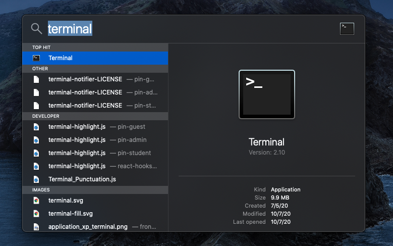
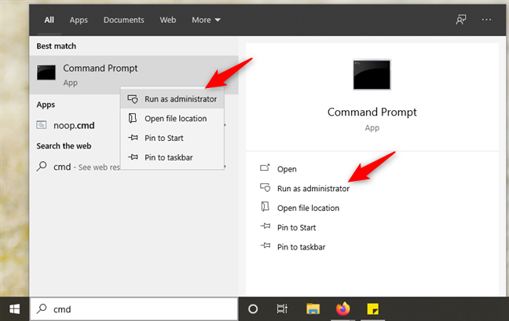
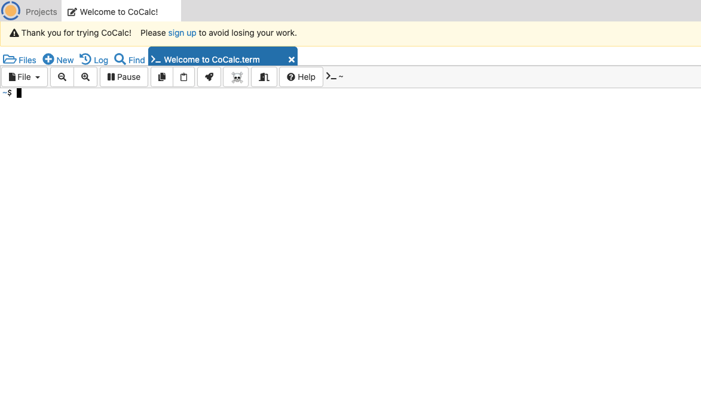
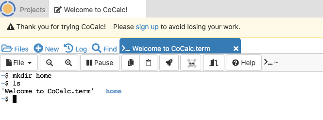
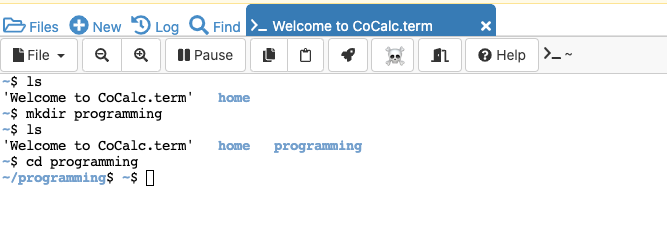
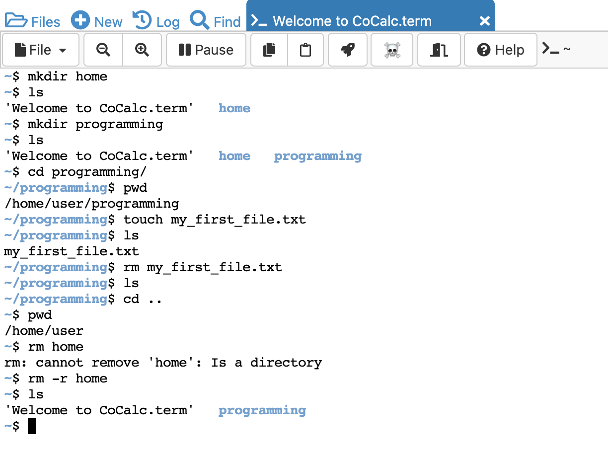

<h1>Section 5: System Administration and Command Line</h1>

The purpose of this section is to introduce you to the following concepts: 
- Developing a better understanding of the CLI and how it works.
- Understanding how the CLI is used in computing.
- Learning some basic commands.

<h2>Command Line Interface</h2>

**Key Terms**
- **Command Line Interface**
- **Shell**
- **Terminal/Command Prompt**
- **Bash**
- **Directory**

As discussed in the last section, the command line interface (CLI) is a program that accepts text input to execute operating system functions. A type of CLI is a **shell**. A shell can be defined as a user interface for access to an operating system's services. This is the traditional way computers used to receive their commands before GUI’s were used. The shell acts as an intermediary between the user and the operating system’s internal parts, in which it gets its name from being the <i>outer layer</i> of the operating system. How do you get into the shell? Well, when you’re logged into the OS, you are logged into the shell as well giving you instant access to start working it.

You’ll find that most Linux systems use a **bash** shell to receive its commands as it is the default shell on Linux. Bash is short for **B**ourne **A**gain **SH**ell and is a command language interpreter for GNU operating systems. This is the reason that so many Linux systems use bash. Although other shells do exist and are associated with the GNU Project, bash is often the default interpreter for most of its operating systems including Linux, Mac OS, and Windows. 

How can you access the bash shell? Well you need to open your **terminal**, if you are using Linux or Mac OS, or the Command Prompt if you are on Windows.The Terminal and Command Prompt are programs that allow you to work and interact with your computer's shell. In this program, you can navigate through your computer’s directories and files.

    
    

Fun Fact: The terminal actually started as a piece of electronic hardware that was used for taking inputs and giving outputs of data and then programmers turned to electronic typewriters, sometimes referred to as a teletypewriter, before the first video display was used in the 70’s. 

<h2>Why Use the CLI?</h2>

The CLI is popular among more experienced users because it provides a heavy focus on its file commands and manipulation that would otherwise be more difficult using a GUI. After becoming acquainted with its commands, working in the terminal offers many advantages.
- The CLI allows for users to gain more flexibility than using a GUI. This is because while using a CLI, users have the option to be a bit more granular in what they want accomplished.
- Since there isn’t much visual representation that a CLI needs, it generally responds and completes tasks faster than a GUI.
- The CLI also allows for automation of tasks. Think if you have to do a task over and over, the CLI allows for the user to create shortcuts to complete tasks so that you no longer need to go through a long process, but instead enter a few customized commands.
- The CLI allows for easy installation of packages for your code.

<h2>Working with Basic Commands</h2>

**Key Terms**
- **Directory**
- **Working Directory**

When working in the terminal, you are working directly with the folder structure of your computer navigating through its directories. A **directory** can be thought of as a folder in your computers File Manager or Finder (depending on Windows or Mac). While navigating through folders and files, you can create and delete directories and even create, read, edit ,or delete files. There is a large list of Linux commands that help you to accomplish these tasks and many more.

Before we jump into some commands, head to this link to use a <a href="https://cocalc.com/doc/terminal.html">terminal emulator</a>. This will give you a real feel into what interacting with a command line interface is like. Although there is no access to your personal computer’s file structure this is meant to give you (the student) some comfortability with the commands as they will become important for Workshop II and lessons to come. After clicking the link, click on "Run Terminal Now". You should see this window:

    <kbd>
        
    </kbd>

 

If you do not see this window, click into the “Welcome to CoCalc.term” project to get there.

There are a vast number of commands that can be executed in the terminal, but here are some for navigating your computer’s directories:

- **pwd**: Short for “path working directory”. A **working directory** is the folder you are currently working in or making changes to (We will come back to this later)
- **ls**: This command displays the contents of your working directory usually consisting of folders and files
- **cd**: Short for “change directory”, this commands changes your working directory to what you specify.
- **mkdir**: This command creates directories/folders in you current working directory
- **touch**: This command creates files in you current working directory
- **rm**: This command deletes directories and files.

Let’s practice in our terminal emulator. Since our emulator doesn’t have access to our computers actual folder structure, we are going to give it one. In the emulator type in: `mkdir home` where the empty box is. This is where your command line is. Hit enter and then type in `ls` to check if we successfully created the folder “home”.

    <kbd>
        
    </kbd>

 

Great! As you can see we created the “home” folder and it is accompanied by the default “Welcome to CoCalc.term” file. Let’s go ahead and create a second folder in our current working directory named “programming” and “cd” into it. This would look like the following:
`mkdir programming`

Followed by:
`cd programming`

Now your working directory will be the “programming” folder. Your terminal should resemble the following:

    <kbd>
        
    </kbd>

 

We can check to make sure we are in our working directory by executing `pwd` in our terminal. This will give us the output “/home/user/programming”

In this folder, use “touch” to create a file named “my_first_file.txt”. This command will look like:
`touch my_first_file.txt`

Use `ls` again to make sure that the file was created.

Now that we have created the file, lets delete it from the programming folder. Use the following in your terminal to do so:
`rm my_first_file.txt`

Check to make sure it is deleted using `ls`. You shouldn’t get an output since there isn’t anything in the folder anymore. Next use `cd ..`. This command will bring you 1 level “up” from your current working directory. If you check with `pwd`, you’ll see your path is now “/home/user”. Now try deleting the “home” folder using `rm home`.

 Having an issue? That’s because “rm” alone cannot delete directories. To delete directories, we have to pass a flag to the “‘rm” command. Enter the following into your terminal:
`rm -r home`

Voila! The home folder is now deleted. If you check you contents of your working directory, you'll see only the programming folder is left. See the below for a step-by-step image:

    <kbd>
        
    </kbd>

 

Let's review the commands we've learned so far:
- We used `mkdir` and `touch` to **create** folders and files
- We **checked** what our working directory was by using `pwd`
- We **changed** our working directory with `cd`
    - We also learned that using `cd ..` will take you one level up
- We **checked** the contents of our current working directory with `ls`
- Lastly, we **removed**/**deleted** files using `rm`
    - And we used the `-r` flag to remove folders

<h2>Section 5 Review Questions</h2>

1. **The following are all incorrect except:**
    
<b>a.</b> Bash is short for “Basic Alternative Shell” (L)

    
<b>b.</b> A directory can be thought of as a folder (W)

    
<b>c.</b> Linux does not come with a terminal (Z)

    
<b>d.</b> Using the terminal, you cannot edit files (A)

     

2. **Which of these are advantages to using the CLI?**
    
<b>a.</b> Since there isn’t much visual representation that a CLI needs, it generally responds and completes tasks faster than a GUI. (F)

    
<b>b.</b> The CLI allows for easy installation of packages for your code. (O)

    
<b>c.</b> The CLI allows for users to gain more flexibility than using a GUI. This is because while using a CLI, users have the option to be a bit more granular in what they want accomplished. (I)

    
<b>d.</b> All of the Above (R)

     

3. **`pwd` is how you check your working directory in the terminal. True or False?**
    
<b>a.</b> True (O)

    
<b>b.</b> False (A)

     

4. **What command allows you to create new files?**
    
<b>a.</b> ls (T)

    
<b>b.</b> pwd (P)

    
<b>c.</b> touch (N)

    
<b>d.</b> rm (E)

     

5. **What command allows you to remove files?**
    
<b>a.</b> ls (N)

    
<b>b.</b> pwd (L)

    
<b>c.</b> touch (S)

    
<b>d.</b> rm (G)

     

**What word is spelled wrong in the dictionary?  _ _ _ _ _**
