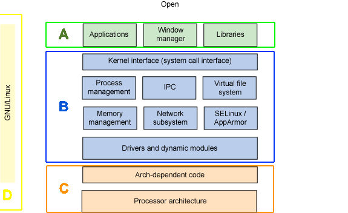
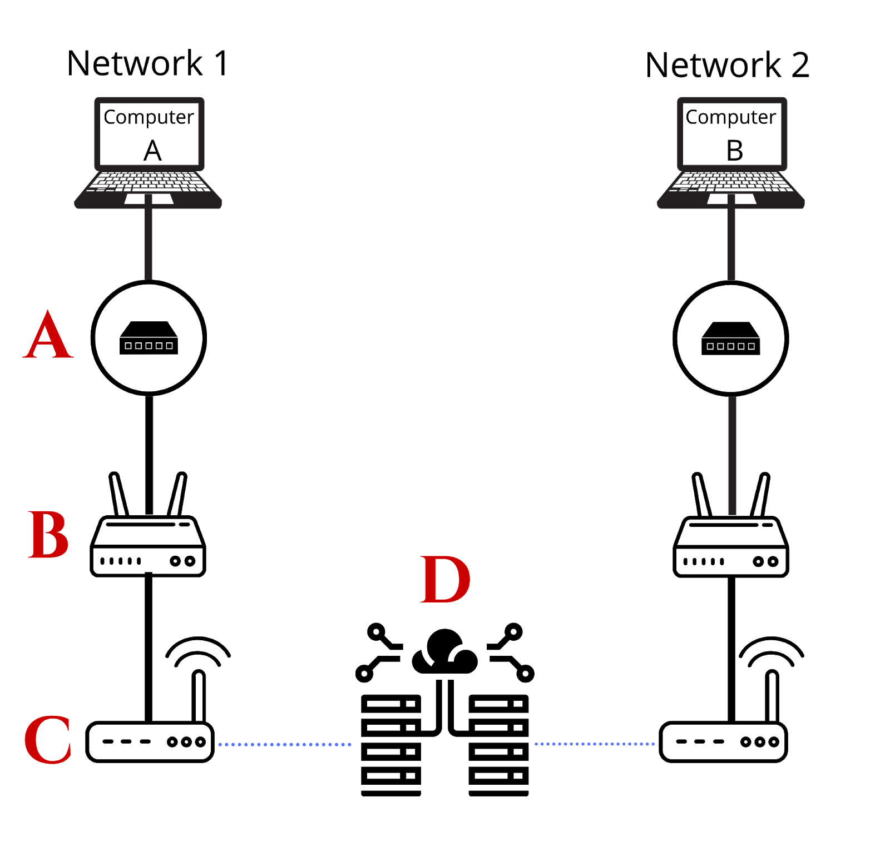

<h1>Review</h1>

<h3>Section 1: Hardware and Computing</h3>

What is a computer?

What is hardware?

Components of a computer:
<ul>
<li>Processor</li>
<li>Memory</li>
<li>Storage </li>
<li>Motherboard</li>
<li>I/O Devices</li>
</ul>

<h3>Section 2: Software and Operating Systems</h3>

What is software?

What is an operating system?

Examples of Operating systems:
<ul>
<li>Windows </li>
<li>Linux </li>
<li>Raspbian</li>
</ul>
Programming Languages

<h3>Section 3: Number Systems and Programming Languages</h3>

What is a number system?

Examples of number systems:
<ul>
<li>Decimal </li>
<li>Binary</li>
</ul>
What is Python?

What is object oriented programing?

<h3>Section 4: Networking and The Internet</h3>

What is a network?

Networking terms:
<ul>
<li>Switch</li>
<li>Access Point</li>
<li>Router</li>
<li>Modem</li>
</ul>
How does the internet work?

<h3>Section 5 & 6: System Admin and CLI</h3>

Command Line Interface

Why Use the CLI?

Linux Commands

<h3>Section 1-6 Summary</h3>

A computer can be described as a machine that accepts **inputs**, performs some **functionality**, and produces an **output**. The main processor in a computer, which is often referred to as the brain, is called the **CPU**. In addition, memory is necessary for modern computers to operate. Memory has two forms: the first form is **volatile** meaning it is not stored on the computer once it is turned off and **non-volatile** meaning it persists even when the computer powers off. The primary component of short-term (volatile) memory for your computer is the **RAM**. The **motherboard** is the circuit board that brings the primary computer components together. A **peripheral** is an external device that provides input or output to the computer. One example of a device that provides both an input *and* an output is a **touch screen**. The Raspberry Pi, which is an example of a **single-board** computer has GPIO pins, which allow for "General Purpose Inputs and Outputs".

An **operating system** is the software that manages all of the hardware resources associated with your desktop or laptop. The two types of interfaces are **CLI** and **GUI** which stand for **Command Line Interface** and **Graphical User Interface**, respectively. The operating system (OS) we will be using in this course is **Linux**. A Linux OS has two primary spaces- the **kernel-space** where processes happen that are removed (or in programming words "abstracted") from the user, and the **user-space** where a user interacts with the system.

A network is a group of computing devices that communicate with one another to share information. Computers create **Local Area Networks (LANs)** by connecting to each other in a single location using **switches and access points**. In order for computers on different networks to communicate with each other, they need to use a **router**. A router’s job is to connect different networks together, creating a **Wide Area Network (WAN)**. The internet is the most prominent example of the WAN network type. The **internet** is a network issued by **internet service providers (ISPs)** that allow local networks from all over the world to connect to each other using **modems**.

The terminal/command prompt are programs that allow a user to interact with their computer's **shell**, a type of **command line interface**. In most cases, **bash** is the default shell a computer uses. The command line provides a strong alternative to using the graphical user interface, or "GUI". Programmers often use the command line as it can be faster than using the GUI for tasks such as directory management, installing packages, and others. Additionally, there are many commands at the helm of the user giving them more flexibility in how tasks are executed. The commands learned in previous sections are the basics of what a programmer would utilize in the shell.

Python is a(n) **interpreted** programming language meaning it is compiled by a(n) **interpreter**. That compiled code, in the case of Python, is broken down into a type of binary called **bytecode**. The other type of binary is called **machine code**, which consists of 0’s and 1’s.

<h3>Section 1-6 Takeaways</h3>

The above materials all relate in some way to our upcoming workshop. Here is a summary of each section and how it pertains to our computer setup that we will be building during the workshop period.

1. A student will understand the hardware elements such as the **RAM**, **CPU**, **ports**, and **peripherals** before putting your Pi together. Teachers will use terminology from our first lesson when putting the computer together to explain what each component of the computer does. Other components like the GPIO pins will be utilized when students are building their final project.

2. Software for the student’s computer will be built on top of an **operating system**, which in this case will be the Linux, Debian-based OS called Raspbian. Students will understand the difference between a **CLI** and **GUI** before using various tools that can accomplish the same task (such as using an inline text editor using the CLI vs. a code editor program using the GUI).

3. Students will have a general understanding of how **networks** and the **internet** work. To finish the project, a student will have to run a server on their network which then makes a request to another server on the internet.

4. Students will have a strong understanding of the **command line** and **bash**. The command line program that is native to the Raspberry Pi computer is called the "terminal". Students will use the command line to navigate their computer’s directories, utilize **CLI** tools such as "git" to assist in the development process, and create **bash** aliases to make shortcuts for commands.

5. Students will learn the object-oriented programming language **Python**. Python is considered an interpreted programming language, and the computer a student uses will already have an interpreter installed to ensure that Python runs smoothly on the machine.

<h2>Section 1-6 Review Exercises</h2>

<h4><ins>Section 1</ins></h4>

**Exercise**: Identify the following hardware components based on their definition.
Key:
- CPU
- Memory (RAM)
- Storage (SSD)
- Motherboard 
- Peripheral Device 

Questions: 

<b>A) </b> Main circuit board inside a computer that connects the different parts of a computer together: ______

<b>B) </b> The brain of the computer: ______

<b>C) </b> A(n) _____ is a device that provides either an input or output function for a computer:

<b>D) </b> Component of your computer that allows you to store and access data on a long-term basis: ______

<b>E) </b> The device that is used to store information for immediate use: ______

<h4><ins>Section 2</ins></h4>

**Exercise**: Fill in the blank.

    <kbd>
        
    </kbd>

Key:
- CLI
- Kernel Space
- Operating System
- Linux
- Hardware
- Linux/GNU
- User Space
- GUI

<b>A) </b>Part of the computer that the user interacts with and where user processes run: ______

<ul><li>The two types of interfaces that a user would use to interact with their computer are _____ and _____</li></ul>

<b>B) </b>Part of the computer where the kernel is run and provides its services: ______

 

<b>C) </b>Physical components of a computer: ______

 

<b>D) </b>Part of the computer’s software that encompasses both the user-space and kernel-space: ______

<ul>
<li>    In the case of our computers, the operating system is formally referred to as ______/______ (to include the open source software tools that compliment the OS)
</li>
<li>
    In the case of our computers, they are informally referred to as simply the operating system named _____
</li>
</ul>

<h4><ins>Section 3</ins></h4>

**Exercise**: Converting Number Systems

|exponent|27|26|25|24|23|22|21|20|
|---|---|---|---|---|---|---|---|---| 
|Value|128|64|32|16|8|4|2|1| 
|OFF/ON|0 or 1|0 or 1|0 or 1|0 or 1|0 or 1|0 or 1|0 or 1|0 or 1|

Questions:

<ins>Binary to Decimal</ins>
1. 11100011 = ________
2. 10101010 = ________
 

<ins>Decimal to Binary</ins> (<b>Note</b>: Teacher should demo 50 being converted to binary)
1. 10   = ________
2. 128  = ________

<h4><ins>Section 4</ins></h4>

**Exercise**: Identifying Network Diagram

    <kbd>
        
    </kbd>

Key:
- Modem
- Switch
- Internet Service Provider
- Router
 

<b>A) </b>This device allows locally connected computers to share information and "talk" to each other ______

<b>B) </b>This is a device that forwards data across networks ______

<b>C) </b>This is a small network device that connects other devices to the Internet ______

<b>D) </b>This is an organization that provides services for accessing the Internet ______

<h4><ins>Section 5 & 6</ins></h4>

**Exercise**: Defining Basic Commands

<b>A) </b> This command creates directories/folders in your current working directory

<b>B) </b> This command allows the user to change the working directory

<b>C) </b> This command deletes directories and files

<b>D) </b> This command displays the contents of your working directory, usually consisting of folders and files

<b>E) </b> This command outputs your current working directory

<b>F) </b> This command creates files in your current working directory

 

1. `pwd`      _____
2. `ls`       _____
3. `cd`       _____
4. `mkdir`    _____
5. `touch`    _____
6. `rm`       _____

<h2>Section 1-6 Review Questions</h2>

1. **Which of the following is not considered a basic function of a computer?**
    
<b>a. </b> Provides an output to a user (A)

    
<b>b. </b> It has a Graphical User Interface (T)

    
<b>c. </b> It accepts input from a user (R)

    
<b>d. </b> It performs calculations based on an input (C)

     

2. **Which of the following facts apply to all Linux operating systems?**
    
<b>a. </b> They have native NGU Tools (L)

    
<b>b. </b> The utilize the Linux kernel (H)

    
<b>c. </b> They are Debian-based (T)

    
<b>d. </b> None of the above (E)

     

3. **Which of the following software is needed to run a Python file on your computer?**
    
<b>a. </b> A compiler (A)

    
<b>b. </b> Bash (I)

    
<b>c. </b> The Linux kernel (O)

    
<b>d. </b> An interpreter (E)

     

4. **All computer data is represented using _____?**
    
<b>a. </b> The trinary number system (H)

    
<b>b. </b> The decimal number system (M)

    
<b>c. </b> The english language (P)

    
<b>d. </b> The binary number system (L)

     

5. **Which of the following is a common program that you write when you are first learning a programming language?**
    
<b>a. </b> Programize (A)

    
<b>b. </b> Hello World (E)

    
<b>c. </b> Good Morning (P)

    
<b>d. </b> Welcome Program (Q)

     

6. **Which of the following are considered the two basic types of Networks? (Choose 2)**
    
<b>a. </b> WAN (T)

    
<b>b. </b> PAN (M)

    
<b>c. </b> NAN (H)

    
<b>d. </b> LAN (T)

     

7. **The internet is considered the most prominent example of the LAN network type.**
    
<b>a. </b> True (M)

    
<b>b. </b> False (E)

     

8. **The CLI is an example of a**
    
<b>a. </b> Programming Language (H)

    
<b>b. </b> User Interface (R)

    
<b>c. </b> Number System (S)

    
<b>d. </b> Operating System (W)

     

9. **The "cat" command allows the user to do all of the following EXCEPT:**
    
<b>a. </b> Create files in the current directory (A)

    
<b>b. </b> Delete files (M)

    
<b>c. </b> Read the contents of files (L)

    
<b>d. </b> Add to the end of files (E)

     

**What comes once in a minute, twice in a moment, but never in a thousand years?  '_ _ _ - _ _ _ _ _ _ - _'**
