
<h1>Hardware and Computing</h1>

<h2>The Purpose of this Section</h2>

The purpose of this section is to introduce you to the following concepts:

- What is hardware?
- What is a computer?
- What are the components of a computer?
- What is a Raspberry Pi?

<h2>What is a Computer?</h2>

A computer is an electronic device that manipulates information or data. The computer sees data as 1's and 0's (also called "binary"), but it knows how to combine them to create much more complex things like photos, movies, websites, games, and much more.

Computers can be defined as any device that can:

1. Accept an input
2. Perform calculations based on that input
3. Provide an appropriate output

A computer system consists of two major elements, hardware and software. In this lesson, you are going to learn about hardware.

<h2>What is Hardware?</h2>

**Hardware** refers to the physical elements that make up a computer. These are the <ins>components that you can physically touch.</ins>

Computers are composed of several hardware components. Some might be more familiar than others. In this lesson, you will learn to recognize some of the different components of a computer and begin to understand what they do.

<h2>Core Components of a Computer</h2>

<h3>1. Processer</h3>

#### Key Terms
- **Central Processing Unit (CPU)**
- **Arithmetic Logic Unit (ALU)**
- **Control Unit (CU)**

Processors are the components in computers that process and execute inputs received from hardware and software. This term can also be referenced as the Central Processing Unit. 

The CPU is thought of as the brain of the computer. 

<!-- FIXME: Remove brain or add back toolbelt -->

    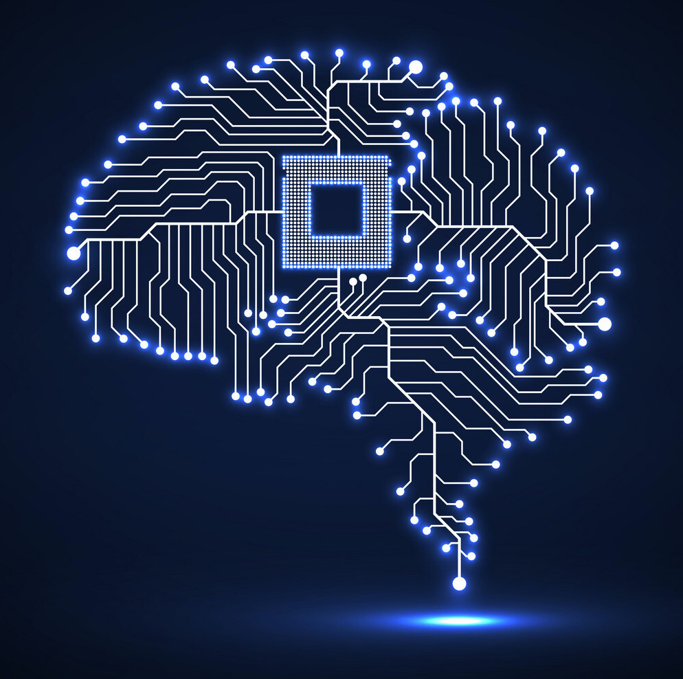

We all know how the human brain works: it receives information, processes it, and responds to it by doing something. The CPU works in the same way. All of the inputs from the other parts of the computer are sent to the CPU, where it processes the information it receives and it sends the output as a response.

There are two components that make up the CPU, the **control unit** and the **arithmetic logic unit (ALU)**. 

The control unit is a digital circuit that <ins>directs operations within a computer's processor</ins>. The ALU is the digital circuit inside the processor that <ins>handles arithmetic and logical operations</ins>.

The following list describes how the control unit and the ALU work together to perform basic CPU functions:
1. First the control unit receives instructions from another part of the computer and decodes the instructions into commands. 
2. Then the control unit provides the ALU with these commands so that the ALU can execute them.
3. Finally the ALU returns information back to the control unit, and the control unit returns the data back to the other part of the computer.

Isn’t that process strangely familiar? First there is an input received, then a calculation is performed, and then an output is provided..Oh yeah! This is pretty much the same process described earlier in the lesson as the three basic functions of a computer. 

However, the question still remains: What component is performing that input and receiving that output? In the next section you will learn about memory.

    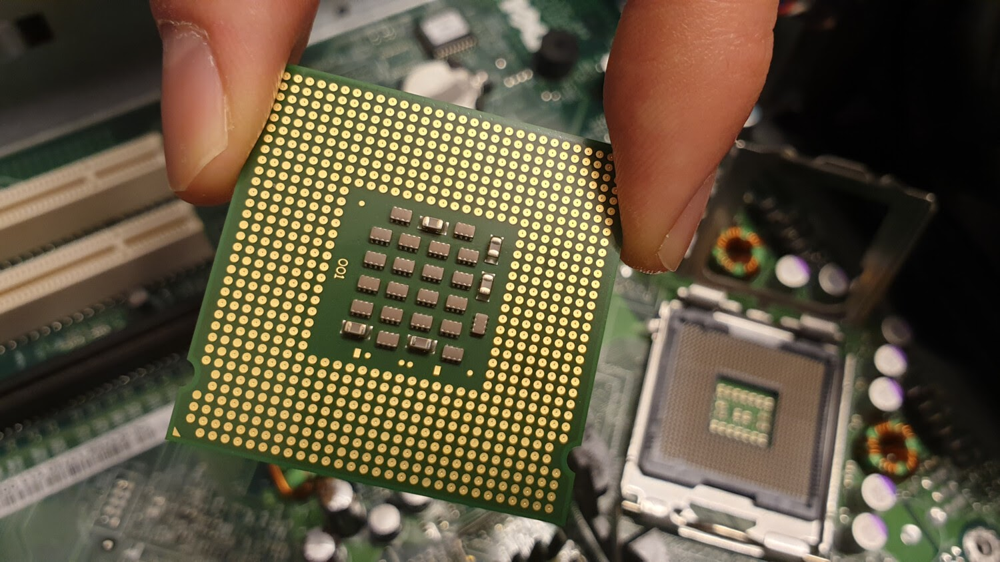

<h3>2. Memory</h3>

#### Key Terms
- **Random Access Memory (RAM)**
- **Volatile Memory**

In computing, memory refers to the device that is used to store information for immediate use. Memory is the component within your computer that allows you to access data that is stored for a short term. 

While memory can refer to any medium of data storage, it usually refers to RAM, or **random access memory**. RAM is responsible for storing and accessing information it needs in the moment and in the near future. 

Some examples of operations that use RAM are:
  
- Running your Operating System
- Using applications    
- Browsing the web
- Editing documents or spreadsheets 

RAM is an example of **volatile memory**. Volatile memory is a temporary form of memory that is <ins>lost when you turn off your computer.</ins>

Still trying to understand RAM? Let's think of our CPU as an engineer. The engineer can only have one tool in their hand at a time, but the engineer needs to be able to grab another tool when they need it.

What does the engineer do? Luckily, they have a toolbelt called ‘RAM’ that is not as fast as whatever it is in hand but is still easily accessible.

When the engineer needs a tool that is not in hand nor their toolbelt, they have to go all the way back to the truck full of tools called the ‘Storage Drive’ (we will go over this in the next lesson). As you can tell, getting a tool from the truck is MUCH SLOWER than accessing the tools in their belt or in hand. 

So essentially the more RAM you have, the more stuff you can have on you without having to go to your storage drive when you need it. For this reason, the amount of memory you have installed on a computer plays a key role in how your system performs.

    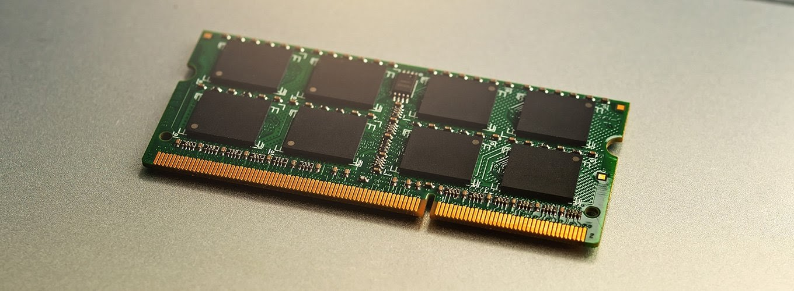

<h3>3. Storage</h3>

**Key Terms**
- **Hard Drive**
- **Non-Volatile Memory**
- **Hard Disk Drive (HDD)**
- **Solid State Drive (SSD)**

Storage is the component of your computer that allows you to store and access data on a long-term basis.

Computer storage is considered non-volatile because it is capable of retaining saved data even without power. This means that information stored with **non-volatile storage** is not lost when you turn off your computer.

The following examples outline some of the more popular forms of computer storage:

##### Hard Disc Drive (HDD)
A **hard disk drive** is an electro-mechanical data storage device that uses magnetic storage to store and retrieve digital data using one or more rigid rapidly rotating platters coated with magnetic material.

    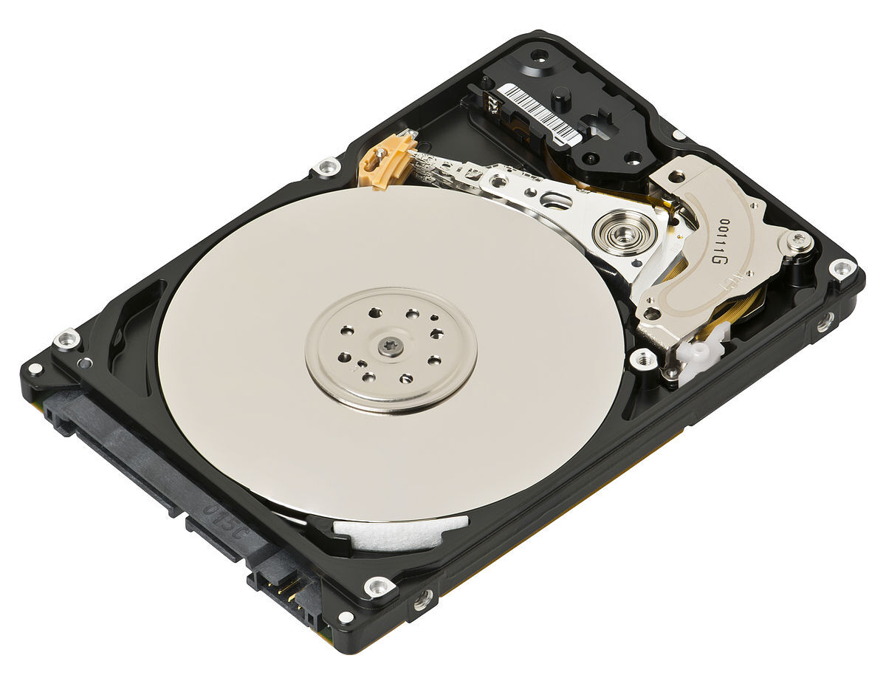

**Pros:**
- Lower Price
- Better for long term storage

**Cons:**
- Slower Performance Speeds

##### Solid State Drive (SSD)
**Solid-state storage** is a type of non-volatile computer storage that stores and retrieves digital information using only electronic circuits, <ins>without any involvement of moving mechanical parts<ins>.

A **solid-state drive** is a solid-state storage device that uses integrated circuit assemblies to store data persistently, typically using flash memory

    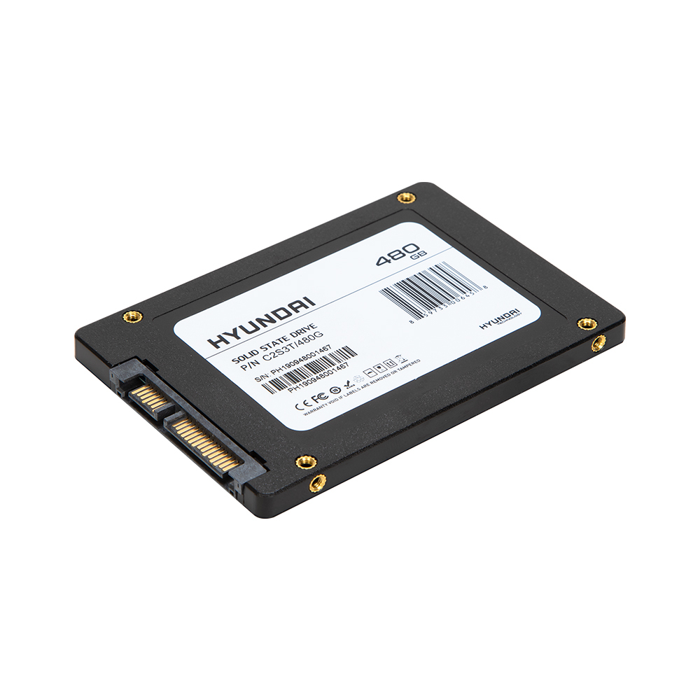

**Pros:**
- Faster Performance Speeds
- Better for Day to Day Operations

**Cons:**
- More Costly

**Some Other Examples of Solid State Storage:**

Security Digital (SD) Card

    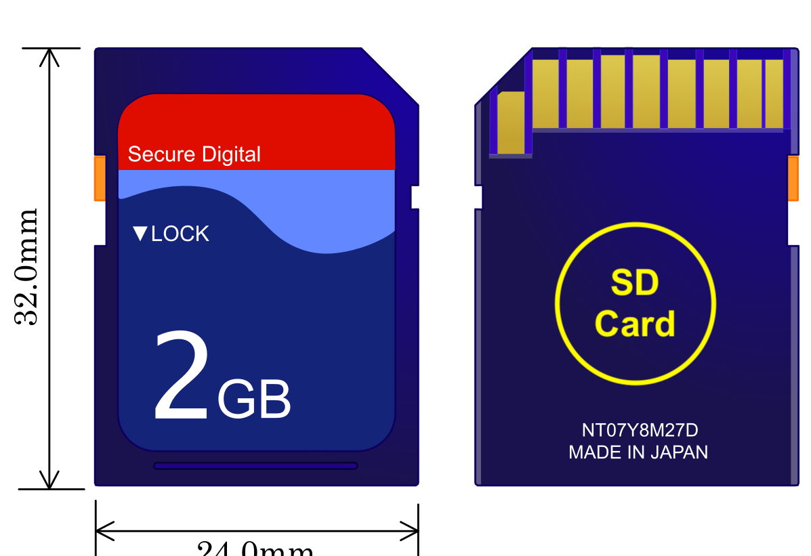

Mini SD Card

    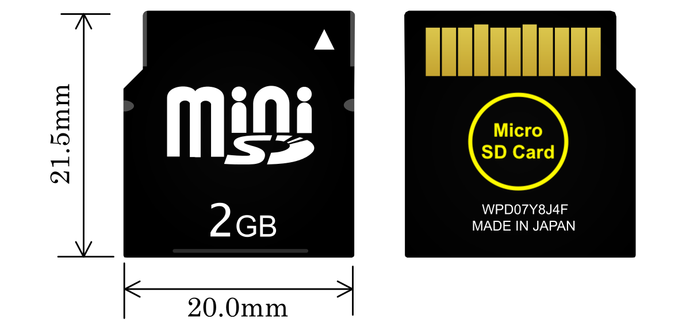

Micro SD Card

    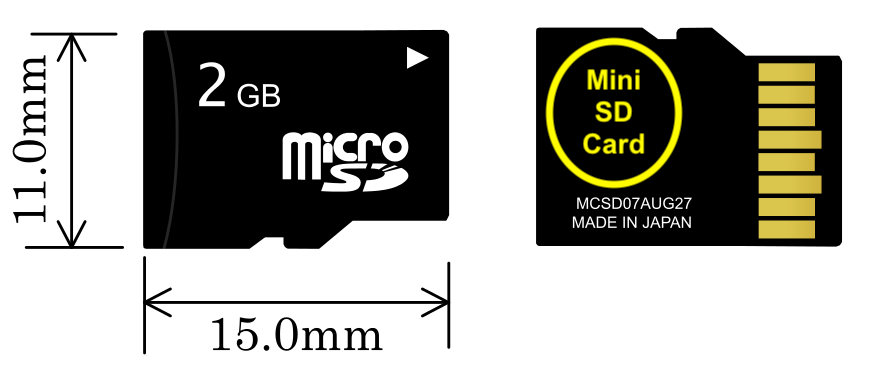

<h3>4. Motherboard</h3>

**Key Terms**
- **Motherboard**

The **motherboard** is the main circuit board inside a computer that connects the different parts of a computer together.

You can think of this piece of hardware as the ‘mother’ of all components, that's where it gets its name. 

    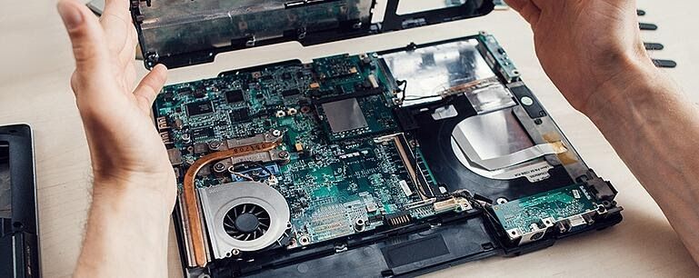

<h3>5. Input/Output Devices and Ports</h3>

**Key Terms**
- **Peripheral Device**
- **Input Device**
- **Output Device**
- **Port**

In computing, a **peripheral device** is a device that provides either an input or output function for a computer. These are sometimes referred to as input/output (I/O) devices.

- **Input devices** include devices like a mouse, keyboard and even webcams. These peripheral devices provide an *input* **to** the computer.

- **Output devices** include monitors, printers, and speakers. These peripheral devices provide an *output* **from** the computer.

- Some devices that provide both an *input* and an *output*. A great example of a peripheral that accomplishes this function is an external flash drive and other storage devices. They can be used to read data (input) or write data (output).

When referring to computer hardware, a **port** is a physical interface found on the front or back of a computer that allows computers to access external devices.

    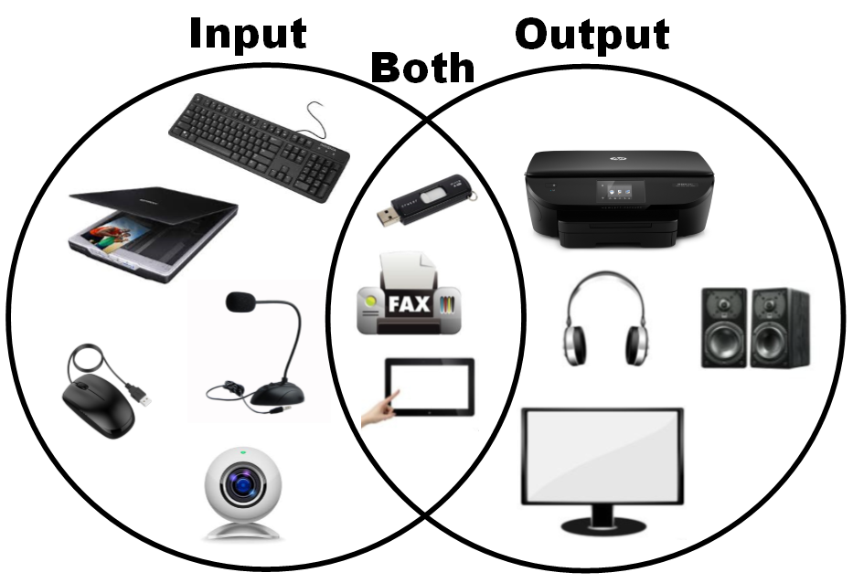

<h2>What is a Raspberry Pi</h2>

A Raspberry Pi is a single board computer about the size of a gift card. Although it is much smaller than your average computer at home, it has similar capabilities to its larger counterparts.

Some of the basic computing tasks that you can do on a Raspberry Pi are:

- Surf the web
- Participate in video conference calls
- Play games
- Watch videos
- Store files

Better yet, Raspberry Pi’s can be used for programming and creating devices such as echo-location devices, weather stations, and more.

The Raspberry Pi is capable of all of these because it contains each major component mentioned earlier in the lesson just as most computers do. Just as a desktop computer would include, A Raspberry Pi is equipped with:

<h4>Central Processing Unit</h4>

    

<h4>Random Access Memory</h4>

    

<h4>Storage</h4>

- Your Pi will have a 16 GB microSD card.

    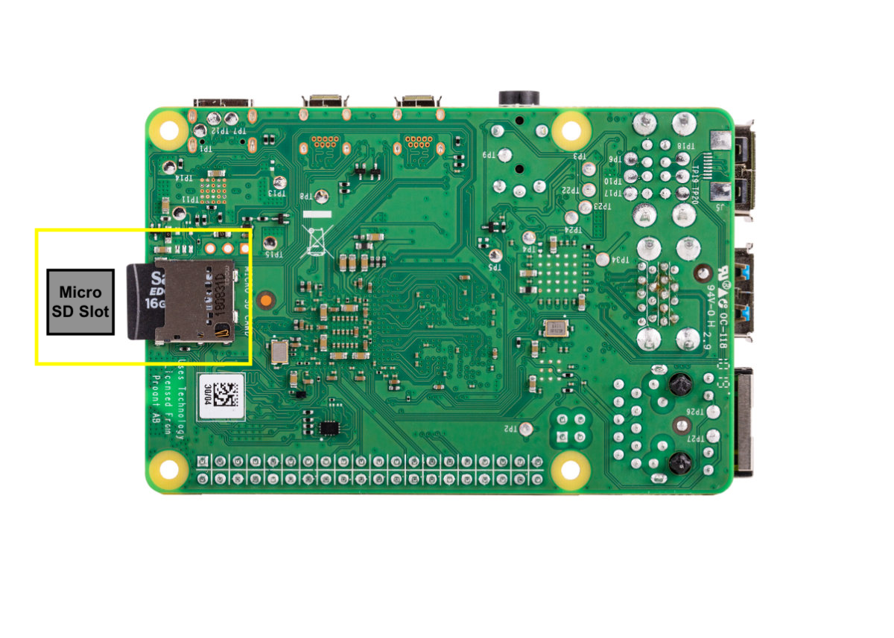

<h4>Motherboard</h4>

- Since the Pi is a single board computer, it is the motherboard.

    

<h4>Input/Output Ports</h4>

- Your Pi will have 2 HDMI ports, 4 USB ports, and an ethernet port.
- Secondly, the Pi also has 40 GPIO (general-purpose input/output) pins used to connect things like LED lights, buzzers, and buttons. (This will be gone over in detail later).

    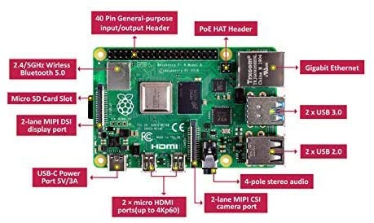

- **USB ports** — these are used to connect a mouse and keyboard. You can also connect other components, such as a USB drive.
- **SD card slot** — you can slot the SD card in here. This is where the operating system software and your files are stored.
- **Ethernet port** — this is used to connect Raspberry Pi to a network with a cable. Raspberry Pi can also connect to a network via wireless LAN.
- **Audio jack** — you can connect headphones or speakers here.
- **HDMI port** — this is where you connect the monitor (or projector) that you are using to display the output from the Raspberry Pi. If your monitor has speakers, you can also use them to hear sound.
- **Micro USB power connector** — this is where you connect a power supply. You should always do this last, after you have connected all your other components.
- **GPIO ports** — these allow you to connect electronic components such as LEDs and buttons to Raspberry Pi.

<h2>Review Questions</h2>

<!-- FIXME: List items need to be a. **b.** **c.** -->

1. **Which of the following is not considered a basic function of a computer?**
    
    
<b>a.</b> Provides an output to a user. (A)

    
<b>b.</b> It has a keyboard. (T)

    
<b>c.</b> It accepts input from a user. (Y)

    
<b>d.</b> It performs calculations based on an input. (I)

    
2. **What is considered to be the brain of a computer?**
    
    
<b>a.</b> Random Access Memory (M)

    
<b>b.</b> Solid State Drive (N)

    
<b>c.</b> Central Processing Unit (O)

    
<b>d.</b> Wireless Keyboard (B)

    
3. **Random Access Memory (RAM) is considered non-volatile, meaning it is capable of holding saved data when the computer is 
switched off.  True or False?**
    
    
<b>a.</b> True (O)

    
<b>b.</b> False (W)

   
4. **Since both SSDs and SD cards use solid-state storage, this means that they have no:**
    
    
<b>a.</b> Moving Parts (E)

    
<b>b.</b> Power (I)

    
<b>c.</b> Passwords (K)

    
<b>d.</b> Flash Capabilities (L)

    
5. **What is something you could do using a Raspberry Pi?**
    
    
<b>a.</b> Browse the internet. (A)

    
<b>b.</b> Store photos. (I)

    
<b>c.</b> Create and edit documents. (K)

    
<b>d.</b> All of the above. (L)

    

**What gets wetter as it dries? A _ _ _ _ _**
