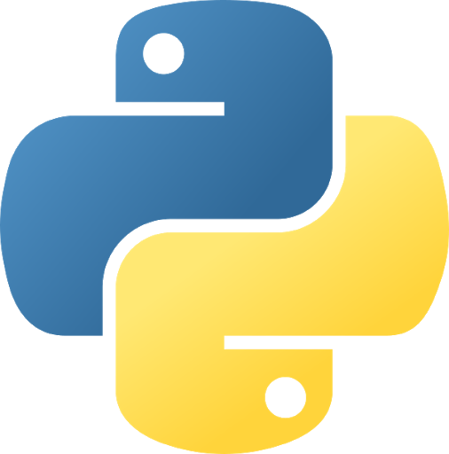
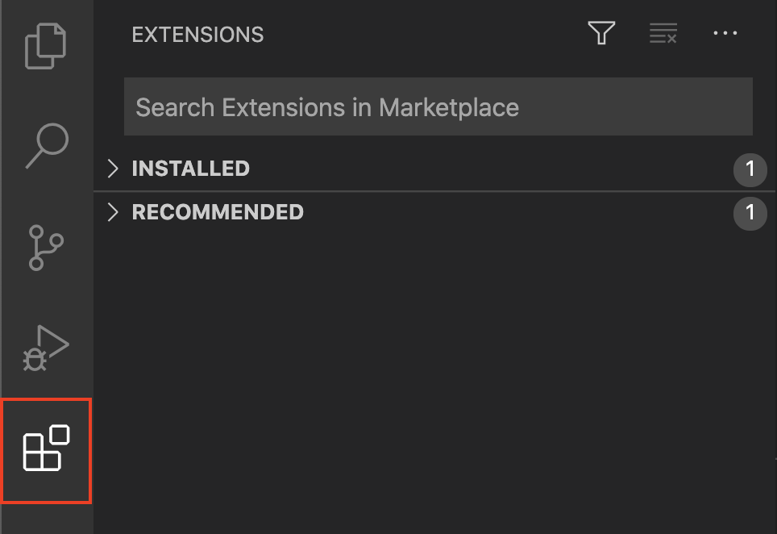
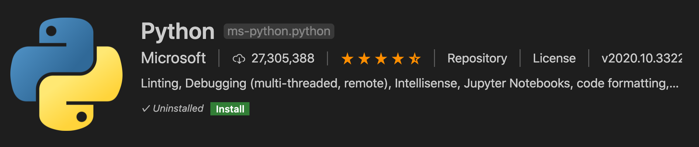
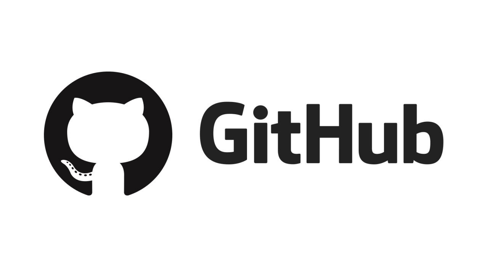
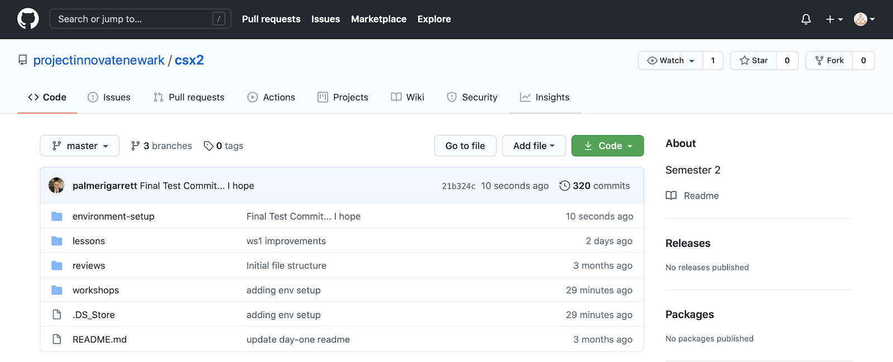
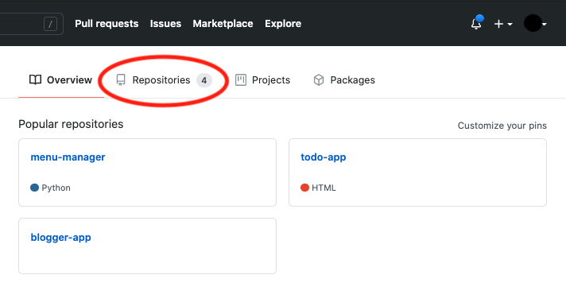
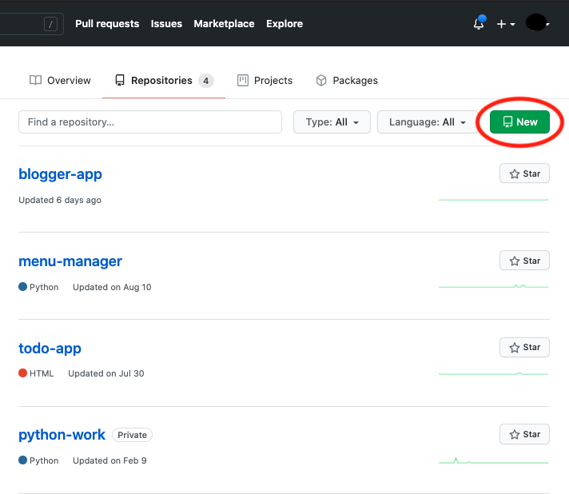
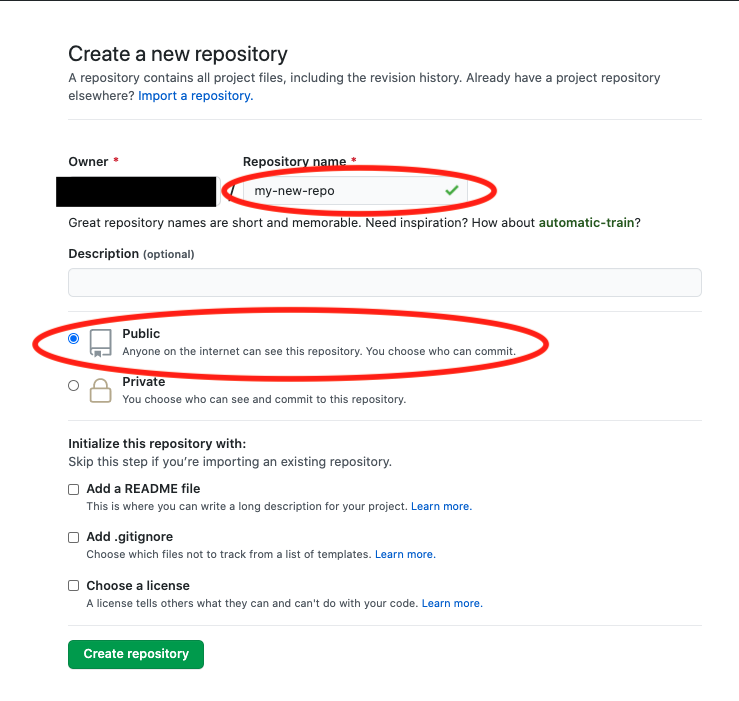
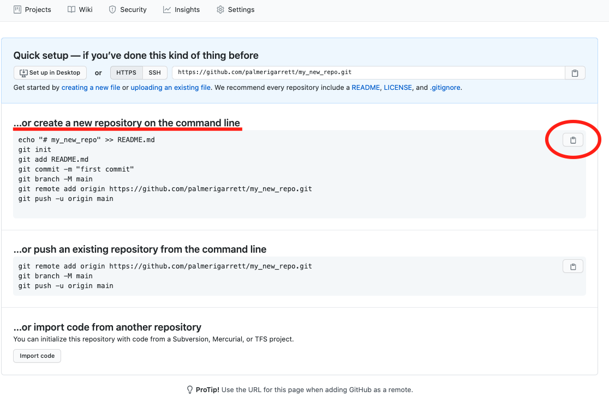

<h1>Environment Setup</h1>

The purpose of this section is to introduce you to the following concepts: 
- Version Control
- Visual Studio Code
- Git
- GitHub
- Bash and Aliases

<h3>Visual Studio Code</h3>

In computing, **source code** is any collection of code that is written using a human-readable programming language, usually as plain text.

**Visual Studio (VS) Code** is a free source-code editor made by Microsoft for Windows, Linux and macOS. A **source-code editor** is a text editor program that is specialized for writing software.  

    

 

**Extensions** are add-ons that allow you to customize and enhance your experience in Visual Studio by adding new features or integrating existing tools. An extension can range in all levels of complexity, but its main purpose is to increase your productivity and cater to your workflow.

    
    

<h4>Installing Extensions</h4>
To install the Visual Studio Code extensions we will be using in this course, open VS Code and go to the extensions tab on the left.

    

First search ‘Highlight' and click Install.

    

Then search ‘Python’ and click Install.

    

<h3>Version Control</h3>

**Version control** is a system that records changes to a file or set of files over time so that you can recall specific versions later.

In software development, a **repository** is a central file storage location. A **branch** is a version of a repository that can act as an independent line of development. A repository can contain multiple branches, which means there are multiple versions of the repository. 

<h3>Git</h3>

**Git** is a distributed version-control system for tracking changes in source code during software development.

    

**Basic Git Commands**
<ul>
    <li>
        <ins>Git Clone:</ins> primarily used to point to an existing repo and make a clone or copy of that repo at in a new directory, at another location
    </li>
    <li>
        <ins>Git Add:</ins> adds a change in a working directory to the staging area.
        <ul>
            <li>
                The <b>staging area</b> is like a rough draft space, it's where you can <b>git</b> add the version of a file or multiple files that you want to save in your next commit (in other words in the next version of your project).
            </li>
        </ul>
    </li>
    <li>
        <ins>Git Commit:</ins> used to save your changes to the local repository.
    </li>
    <li>
        <ins>Git Push:</ins> used to upload local repository content to a remote repository.
    </li>
    <li>
        <ins>Git Pull:</ins> used to fetch and download content from a remote repository and immediately update the local repository to match that content.
    </li>
    </ul>

<h4>Github</h4>

**GitHub** is a code hosting platform for software development and version control using Git. It offers the distributed version control and source code management functionality of Git, plus its own features.

It is important to remember that Git and Github are not the same thing. 
- Git is a  tool used to manage your source code history. 
- GitHub is a hosting service for Git repositories.

In other words, Git is a version control tool and GitHub is the service for projects that use that tool.

    

    

<h3>Using GitHub, VS Code, and Git</h3>

<h4>Creating the Programming Folder</h4>

Open the Pi's file manager, which is the icon at the top of your screen of two folders overlapping. If there is already a "programming" folder in this window, go ahead and delete it. Then, right click where the other visible folders are. Click "New Folder..." and call your folder "programming" (please note the lowercase "p", as folders are case-sensitive).
> The file path will be "home/pi/programming"

Now open up a VS Code Window. If it is not open already from installing the extensions, you can open the window by clicking the Raspberry Pi Icon in the top left of the screen -> Accessories -> Code - OSS (headmelted). Inside the VS Code window, click "Open Folder". Single click on your "programming" folder and click "ok" in the bottom right corner of the window.

The programming folder will be used as the main location in which you save everything coding related. Before moving on, change your working directory to the programming folder in your VS Code window by first opening a terminal using `Shift + Control + ~`. Then, inside the terminal, check the location of your current working directory. What is the command to execute this command, class?

<h4>Creating a New Repository</h4>

Here we are going to create a new Github repository. Navigate to your Github homepage. This can be found at github.com/[YOUR-USERNAME].
Once there, click on "Repositories" as shown in the image below:

    <kbd>
        
    </kbd>

 

Next, click the green button labeled "New".

    <kbd>
        
    </kbd>

 

Here, we will decide on a repository name. Go ahead and name your repository "python-work" (in place of "my-new-repo" in the below picture).
We will also be keeping the repositories public. You want to keep repositories public so they can eventually be used for future employers to look at and see all of the cool projects you've completed.

    <kbd>
        
    </kbd>

 

After doing so, click "Create Repository" at the bottom of the page. GO ahead and move on to configuring your repository on your local machine.

<h4>Configuring a Repository</h4>

After completing the previous section, you should see a screen similar to below. Click the clipboard icon to copy the code:

    

 

Click the circled clipboard icon to copy the commands to create the local repository on your Pi. Head back to your VS Code window and into your integrated terminal. If your terminal window is not opened, click `Shift + Control + ~` and click into the terminal. Then, enter the following commands:

- Check your working directory with `pwd`. It should be your programming folder
- If you aren't in the programming folder, check the contents of your current working directory with `ls`. If you see "programming" in the contents, then you can change into that directory
- If you need to change directories, you can use the `cd` command followed by the name of the folder you'd like to change directories to
- Once you are in the "programming" folder, create a new folder called "python-work" with `mkdir python-work`. Change directories into the "python-work" folder with `cd python-work`. Use the `pwd` command one more time to make sure that you are currently in the "python-work" directory.

When you know you are in the right working directory, go ahead and paste the commands you copied earlier from Github into your terminal. If you are not prompted to enter your username after copying the set of commands, click "Enter".

You will then be prompted to enter your Github credentials. Type in your username when prompted and then hit "Enter". Then you can enter your password, which will **not** display as you type the character.
> Don't be worried if nothing is showing in your terminal when you enter the password, as stated above, as that is for privacy reasons.

If you run into an issue authenticating here, it may be due to GitHub's new authentication rules. To fix this, simply follow this guide to use SSH for secure authentication between your Raspberry Pi and your GitHub account: https://linuxkamarada.com/en/2019/07/14/using-git-with-ssh-keys/#.YZVzMcA8LDs

<h4>Error Handling</h4>

<b><i>1. Please make sure you have the correct access rights and the repository exists.</i></b>  
You are likely receiving this error because:  
a. You don't have the required access rights.  
b. You are pushing to a wrong repository (check its URL).

<h4>Adding Files to Local Repository</h4>

Let's create the classic *hello_world.py* file so we can push it up to the repository using the integrated terminal in VS Code. Check your working directory, and if isn't already in "python-work", change your working directory to "python-work". After you confirm that you are in the correct directory, continue to the commands below.

`cat <<EOF>> hello_world.py`

then in the prompt:

`print("Hello World!")`

and to close the prompt:

`EOF`

followed by clicking "Enter". Now that we have a file with some contents, we are going to push this up to the remote repository.

<h3>Updating Your Remote Repository</h3>

Updating the remote repository is best practice for a couple reasons:

- For starters, it is git’s main function! If you don’t update the repository with the most recent changes to the code, then your team won’t have access to it to collaborate with you.
- Repositories serve as a form of storage for your code. If you keep the remote repository up to date, you won’t lose your code if any technical difficulties arise on your existing computer.

To update the remote repository, we use three (3) commands in the following order:

1. `git add .`
2. `git commit -m "[COMMIT MESSAGE]"`
    - A commit message is like a note to the team that gives a short description of the code that’s being pushed up.
3. `git push`

Now that we know the steps to pushing code to the remote repository, let’s push up *hello_world.py* to your python-work repository in Github. In your terminal, enter the following to push your code to the remote repository:

1. `git add .`
2. `git commit -m "My first commit"`
    - "My first commit" is the commit message, which should represent the code changes you are pushing up to Github.
3. `git push`

<h3>Bash and Aliases</h3>

Early in the semester we discussed that most Linux systems use a **bash** shell to receive its commands as it is the default shell on Linux. Bash is short for **B**ourne **A**gain **SH**ell. Bash is a command language interpreter for GNU operating systems. This is the reason that so many Linux systems use bash. Although other shells do exist and are associated with the GNU Project, bash is often the default interpreter for most of its operating systems including Linux, Mac OS, and Windows. 

In order to load your preferences, bash runs the contents of the **.bashrc file** at each launch. This shell script is found in each user’s home directory. It’s used to save and load your terminal preferences and environmental variables.

Terminal preferences can contain a number of different things. Most commonly, the .bashrc file contains aliases. **Aliases** allow the user to refer to commands by shorter or alternative names, and can be a huge time-saver for those that work in a terminal regularly. In other words, a bash alias is a means of avoiding typing a long command sequence by using an abbreviated shortcut. 

<h3>Creating An Alias</h3>

1. To add aliases, we can append the .bashrc text file using echo. If you remember, echo appends text to the bottom of a text file if you use the format `echo "new text to append" >> someFile.txt`. The first command we are going to add as an alias will replace `git add .`
> How does this impact the staging area?

Next, in the command line enter:
`echo "alias gadd='git add .'" >> /home/pi/.bashrc`

Use the command `cat /home/pi/.bashrc` to confirm the change was made.

We can repeat this process for the following to commands for pushing up code. The terminal commands would look like the following:

`echo "alias gommit='git commit -m'" >> /home/pi/.bashrc`
> Note: A commit message is still needed (in quotes) to be input by a student when the alias is used.
`echo "alias gush='git push'" >> /home/pi/.bashrc`

2. It is also possible to make changes to the .bashrc through the GUI. Click on your file manager in the top left corner of your Pi’s screen. You’ll see something like the following screenshot. Click view and then "Show Hidden" to reveal the hidden files on your Pi.

You will then find the text file .bashrc. Open it and scroll to the bottom where you see our current commands.

Another common command used with Git is `git pull`, which updates your local repository from the remote repository.
- This is especially needed when working with a team on a project.

Add a new line after the gush alias and enter:

`alias gull =’git pull’`

You can also create aliases for non-Git related commands. One example of this is the `clear` command. This linux command clears out the terminal to make it easier to read for the next commands. An easy alias for this would be `c`. Go ahead and try to add this one on your own and the teacher will help in a couple minutes.

3. To start using your new bash aliases, close your terminal in VS Code and open a new one. Now that we have a fresh terminal, let’s change directories into “python-work” and open hello_world.py using `nano` and add the following code `print(“Goodbye World!”).
Close and save the changes you made to the file.
Now that we have changes to push up, let’s use our three new aliases to make changes to our remote repository. 

1. `gadd`
2. `gommit "Saying goodbye"`
    - Yes, we still need a commit message

3. `gush`

Now if you go to your github page at github.com/[YOUR USERNAME]/python-work, you can see your changes were made.

<h2>Section Review Questions</h2>

1. **Version control is:**
    
<b>a.</b> A programming language. (A)

    
<b>b.</b> A hardware component used to manage memory and storage. (W)

    
<b>c.</b> A system that records changes to a file or set of files over time so that you can recall specific versions later. (S)

    
<b>d.</b> An operating system. (H)

     

2. **Visual Studio code is a free _______ made by Microsoft.**
    
<b>a.</b> Interpreter (I)

    
<b>b.</b> Text editor (K)

    
<b>c.</b> Calculator (S)

    
<b>d.</b> Source-code editor  (E)

     

3. **Extensions are add-ons that allow you to customize and enhance your experience in Visual Studio by adding new features or integrating existing tools. True or False?**
    
<b>a.</b> True (C)

    
<b>b.</b> False (C)

     

4. **Git Push is used to upload _____ repository content to a ____ repository.**
    
<b>a.</b> Remote, local (S)

    
<b>b.</b> Local, remote (R)

    
<b>c.</b> Local, local (D)

    
<b>d.</b> Remote, remote (Z)

     

5. **Which of the following statements are true about bash Aliases? (Choose 2)**
    
<b>a.</b> Aliases allow the user to refer to commands by shorter or alternative names. (E)

    
<b>b.</b> Aliases are distributed version-control systems for tracking changes in source code during software development. (J)

    
<b>c.</b> Aliases are not stored in the bashrc file. (M)

    
<b>d.</b> Aliases can be a huge time-saver for those that work in a terminal regularly. (T)

     

**If You Have Me, You Will Want To Share Me. If You Share Me, You Will No Longer Have Me. What Am I? A  _ _ _ _ _ _**
