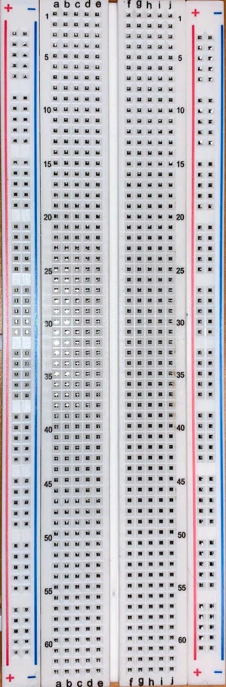
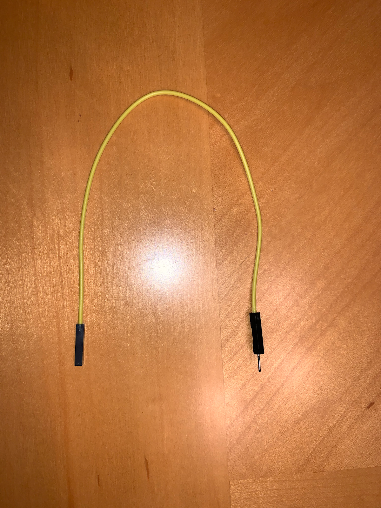
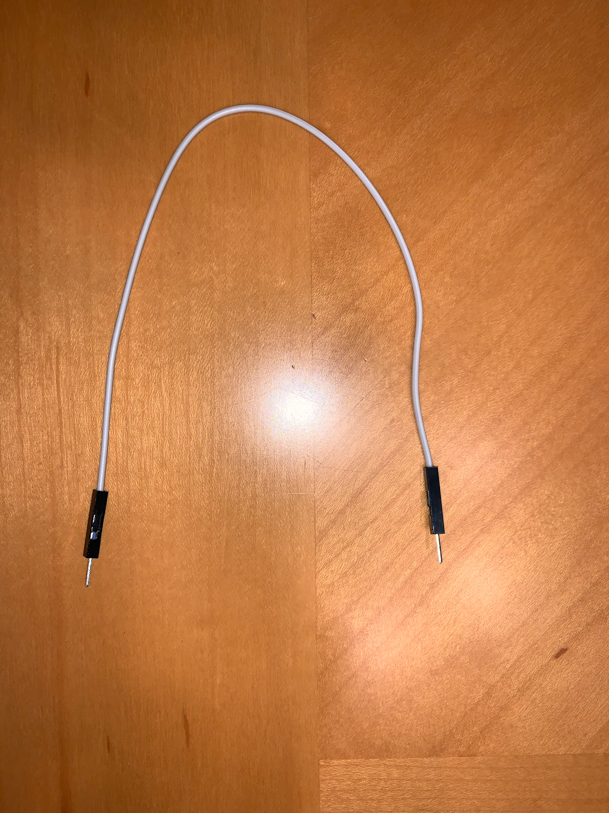

<h1>USing the I/O Devices with Your Raspberry Pi</h1>

In this workshop, the student will learn how to properly connect each of the five (5) peripheral devices to the Pi and make them functional using Python. All students should have the Pi turned on and ready to use for the remainded of the workshop.

As a reminder, here is the list of external parts you need besides your Raspberry Pi Desktop that came with your package:

- One (1) Breadboard
- Fifteen (15) Male-Male Jumper Wires
- Fifteen (15) Female-Male Jumper Wires
- Fifteen (15) Female-Female Jumper Wires
- One (1) Motion Sensor
- Five (5) LED Lights (Assorted colors)
- Three (3) Tactile Buttons
- One (1) Buzzer
- Three (3) Ohm Resistors

<h2>The Physical Components</h2>

<h4>1. The Breadboard</h4>

A breadboard is a device used for temporary or prototype electronics. Breadboards are solderless, meaning that there is no need to melt any wires to allow for an electrical current to pass through.

    

There are **three (3)** types of rails on the breadboard we are using. The **red line** marks the *positive* rail, the **blue line** marks the *negative* rail, and the **component rails** are each row of *five pin holes*. Your breadboard has two sides of each seperated by a gutter in the middle. Utilizing the different rails will be gone over for each I/O device later in the workshop.

<h4>2. Jumoer Wires</h4>

Female to Male:

    

<i>In the image you can see one side of the wire is used to plug <ins>into another device</ins>, while the opposite side is used to plug <ins>other devices into it</ins>.</i>

 

Female to Female:

    

<i>Both ends of the wire are used to plug <ins>other devices into it</ins>.</i>

 

Male to Male:

    

<i>Both ends of the wire are used to plug <ins>into other devices</ins>.</i>

<h4>3. The GPIO Pins</h4>

    

Now you have heard a little bit about GPIO pins earlier in the semester. GPIO is short for "General Purpose Input/Output". An important thing to note right off the bat is that not all pins act the same . Some pins can provide a power *output* such as <ins>3v3 and 5v pins</ins>, others can receive and measure power *inputs* like <ins>"gnd" or ground pins</ins>. Over all though, a majority of the pins are used for reading inputs or providing outputs. 

How can we tell the difference between the pins? The GPIO Zero Python Library provides a comand line tool that is installed by default on your Raspberry Pi, so users can have a better understanding of their Pi. Open the terminal and enter in the prompt, `pinout`. You will see the following:

    

This provides a layout of each pin on your Raspberry Pi and they type of pin it is. You can also see it provides some information on where some of the physical components of your pi are for reference as well.

In this workshop we will refer to pins in a couple different ways.
1. One can be referred to as *GPIO[INSERT NUMBER]*. This would be referencing the pins name that can be seen using the `pinout` function in bold green lettering.
2. The alternative is calling out pins by their physical location such as *physical pin 6* when referring to the **GND** pin on the Pi's 6th pin which can also be seen using the `pinout` function, but instead is the number in paranthesis.

Now that we have a better idea about some of the components we will be using to make our i/o devices functional, let's start using them.

Open VS Code on your Pi and in your *python-work* folder, create a folder named *workshop_3*. Inside the *workshop_3* folder, create a file named "button.py".

<h2>Tactile Button</h2>

A tactile button can be used to give inputs to your Raspberry Pi by clicking the button while a program is running. This clasifies the tactile button as an **input** device. We will first code the button in Python, and then connect physically connect it to the Pi.

1. In button.py, we are first going to import the Button class fomr the "gpiozero" library and the pause function from the "signal" package. To do this, we will enter the following code at the top of button.py: 
`from gpiozero import Button `  
`from signal import pause`

2. Next, we can create an instance of the button class by using the number of the GPIO pin used when setting up our tactile button. We are using the **GIPIO4** pin, so we will specify that in the code and set it equal to the variable `button” as so: 
`button = Button(4)`
> Specifying "4" is how Python knows which pin we will be using. 

3. Next we are going to define 3 methods for our button: `buttonPressed()”, “buttonHeld()”, and “buttonReleased()”. When these methods are used, each will print a statement regarding the action described in their name. Use the following in your file:
> Methods are simply functions that are specific to a certain class. The above methods would not be able to be used with any other class or data type.

        def buttonPressed():
        	print(“Button was pressed”)
        def buttonHeld():
        	print(“Button was held”)
        def buttonReleased():
        	print(“Button was released”)

4. The functions we have now defined will be used in conjunction with the three event **properties** of pressing, holding, and releasing the button. The Button class has: ".when_pressed", ".when_held", and ".when_released".The two properties that are  self explanatory and do not need much explaining are ".when_pressed" and ".when_released". On the other hand, ".when_held" can take in a specified time for the function to run. This is done by specifying “hold_time=[some_float]”, where some_float is a float data type, within the instantiation of our Button class.

`button = Button(4)`  
Will now be: 
`button = Button(4, hold_time = 3.0)`  
This will specify that for the buton_held function will wait 3 seconds before it executes its code.

5. Lastly, we need to use our “button” variable to call these functions. Use the following to do so:

        button.when_pressed = buttonPressed
        button.when_held = buttonHeld
        Button.when_released = buttonReleased`

now when the tactile button is pressed, the method "buttonPressed" will run and print the statement, “Button was pressed”. If the button is helf for 3 seconds, then the "buttonHeld' method will run. WHat do you think will execute when this method is called? Lastly, when the tactile button is released, the "buttonReleased" method will be called.

6. Our complete file should now look like the following:

        from gpiozero import Button 
        from signal import pause

        button = Button(4, hold_time=3.0)

        def buttonPressed():
            print("Button was pressed.")
        def buttonHeld():
            print("Button was held.")
        def buttonReleased():
            print("Button was released")

        button.when_pressed = buttonPressed
        button.when_held = buttonHeld
        button.when_released = buttonReleased

        pause()

> pause() is used to stop your program from running. To do so, we will use "control + c" to quit the program after having finished testing.
>> Check for any indentation errors as copying and pasting into VS Code can be tricky sometimes.

<h3>Assembling the Tactile Button</h3>

We will need the folling components for this section:
- Breadboard
- 1 Tactile Button
- 2 Female-Male Jumper Wires
- 1 Male-Male Jumper Wire

<!-- FIXME: insert image of needed parts-->

**During this section, use the `pinout` command for a visual when GPIO pins are referenced.**

1. Connect a female-male jumper wire from the Raspberry Pi's **GND** pin to the **negative rail** of the bread board. This can be done at any **GND** pin, but we will connect the wire at *physical pin 6*.

<!-- FIXME: insert image -->

2. Next we will place the tactile button across the gutter in th emiddle of the bread board. The top legs should line out with the grounded wire.

<!-- FIXME: insert image -->

3. Connect a male-male wire from the negative rail (directly above where the grounded wire is inserted) of the breadboard and connect it to the row that the top left leg of the button is on.

<!-- FIXME: insert image -->

4. Lastly, connect a female-male jumper wirefrom the Pi's **GPIO4** pin to he breadboard where the top-left leg is placed.

<!-- FIXME: insert image -->

<h3>Using the Tactile Button</h3>

Now that everything is connected, we can execute our Python program. Execute the program by clicking the execute button (the green triangle) at the top right corner of the file.

When you press the tactile button on the breadboard, you should see the following output:

    

Try holding the tactile button now for 3 seconds. You'll see the following output now:

    

Now in the terminal, press the "control button" and "c" at the same time to end the program. You'll know you're successful in quitting the program when you see the following output:

    

Let's move on to learning about the LED light now. Go ahead and disconnect all of the external components to start fresh.

<h2>LED Light</h2>

An LED light can be used to provide an *output* too. When a block of code is executed, the Pi will turn the light on and off. This makes the light an output device. Again, we will code the program in Python first, and then assemble the physical components.

1. In your *workshop_3* folder, create a file named "led.py".

2. We will be using the gpiozero library again to import the LED class to use its .blink() method. The .blink() method has a default timeout of one (1) second and will continue to blink every other second until the program is exited with the pause() function.

3. Paste the following into your "led.py" file:

        from gpiozero import LED
        from signal import pause

        led = LED(4) # 4 is specifying which GPIO pin we will be using.
        led.blink()

        pause()
> Again please look out for indentation errors.

<h3>Assembling the LED Light</h3>

We will need the following components for this section:
- Breadboard
- 1 LED light (any color is fine)
- 3 Female-Male Jumper Wires
- 1 330 Ohm Resistor

<!-- FIXME: insert image of needed parts-->

**During this section, use the `pinout` command for a visual when GPIO pins are referenced.**

1. Connect a female-male jumper wire from the Raspberry Pi's **GND** pin to the **negative rail** of the bread board. This can be done at any **GND** pin, but we will connect the wire at *physical pin 6*.

<!-- FIXME: insert image -->

2. Place the LED light into two holes on the breadboard that are next to eachother, but not on the same row. Also, neither leg should be on the same row as the **GND** wire.
    - The longer leg is the **positive leg**. This should be placed on the left side.
    - The shorter leg is the **negative leg**. This should be placed on the right side.

<!-- FIXME: insert image -->

3. Connect the Ohm resister to the female end of a female-male jumper wire. This is so you have a little more wiggle room, but not necessarily mandatory for funcitonality.connect the jumper wire end to the negative rail next to the **GND** wire and the Ohm resistor end in the same row as the **negative leg** (the right leg).

<!-- FIXME: insert image -->

4. Connect a female-male jumper wire from the Pi's **GPIO4** pin to a hole on the breadboard in the same row as the **positive leg** of the LED light.

<!-- FIXME: insert image -->

<h3>Using the LED Light</h3>

Now that the components are set up,go ahead and execute the Python file. You should see the light blinking for one second on and one second off. You can use "control + c" again to quit the program. Let's move on to working with the buzzer component. Go ahead and disconnect everything as you did with the tactile button.

<h2>Buzzer</h2>

A buzzer can be used to provide an *output* too. When a block of code is executed, the Pi will turn the buzzer on and off. This makes the buzzer an output device. Again, we will code the program in Python first, and then assemble the physical components.

1. First, create a file named "buzzer.py" inside the *workshop_3* folder.

2. Just as we did previously, we will be using the gpiozero library to import the Buzzer class and it's method ".beep()". The ".beep()" function takes two parameters, the amount of time the buzzer is on and the amount of time it is off. Similar to the LED light, these should be floats.

3. Paste the following code in "buzzer.py":

        from gpiozero import Buzzer
        from signal import pause

        buzzer = Buzzer(4)
        buzzer.beep(0.5, 0.5) # 0.5 seconds on and 0.5 seconds off

        pause()
        
> Again please look out for indentation errors.

<h3>Assembling the Buzzer</h3>

We will need the folling components for this section:
- Breadboard
- 1 Buzzer
- 2 Female-Male Jumper Wires

1. Place the buzzer on the breadboard with both legs in column e as noted on the board. The ***positive leg** is the longer of the two. Place this leg on the right side.

2. Connect a female-male jumper wire from the Raspberry Pi's **GND** pin to a component rail in the same row as the **negative leg** of the buzzer. Use *physical pin 6* on the Pi just as before.

<!-- FIXME: insert image -->

3. Connect a female-male jumper wire from the Pi's **GPIO4** pin to a hole in the same row as the **positive leg** of the buzzer.

<!-- FIXME: insert image -->

<h3>Using the Buzzer</h3>

Now you can execute the Python program just as you had done earlier. The buzzer should go off for half a second at a time. After testing, quit out of the program with "control + c" and move on to the next section after disconnecting the components.